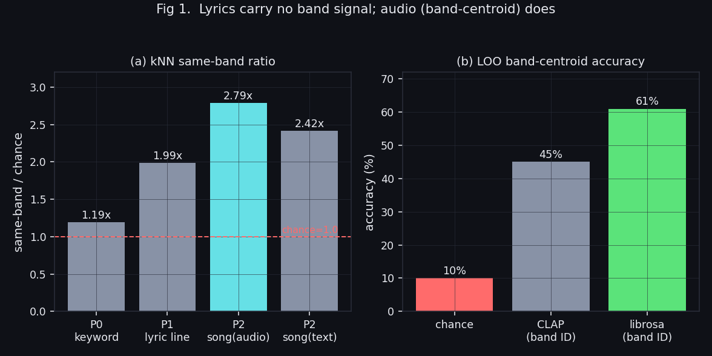
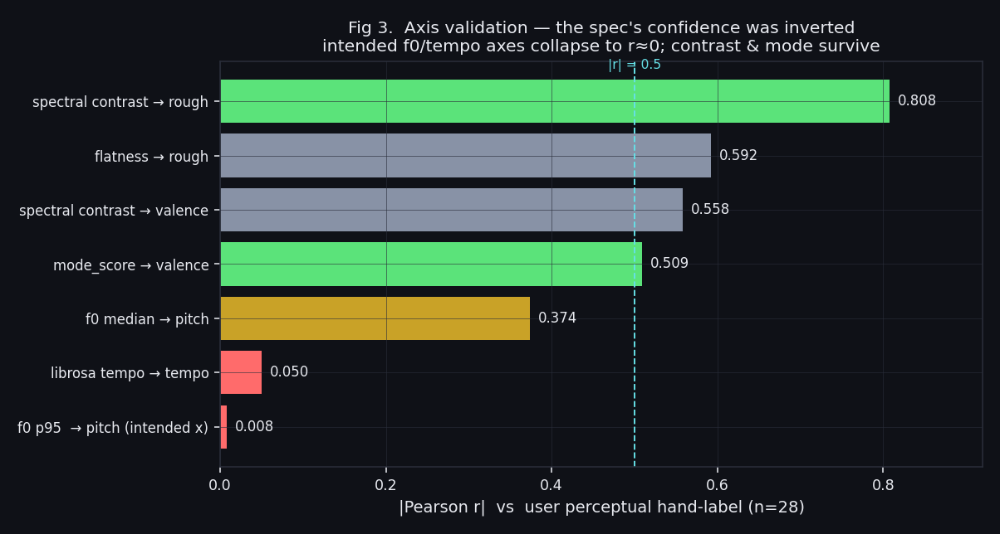
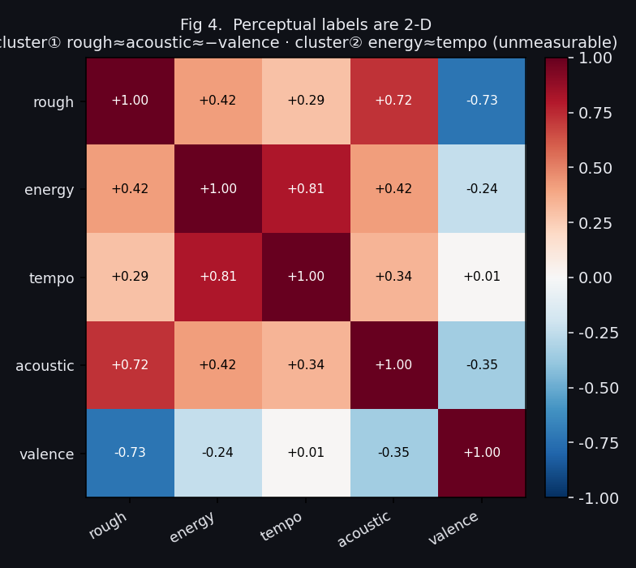
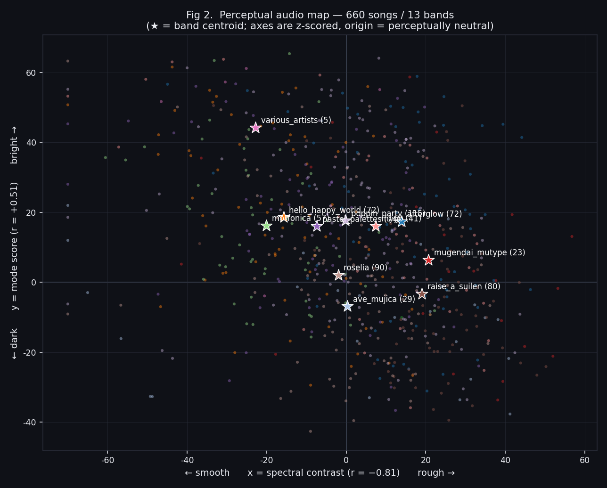

# 가사 의미공간에서 지각 음향축까지 — BanG Dream 밴드 음원맵의 좌표 추출 여정

> **A Perceptual Audio Map for 13 Bands: From Lyric Semantics to Interpretable Acoustic Axes**
>
> 프로젝트: `bandori-song-sorter` · 브랜치 `feature/emoi-cluster → v2 → v3 → v3b`
> 기간: 2026-06-30 ~ 2026-07-04 · 대상: BanG Dream 13밴드 660곡
> 상세 원자료: [`cluster_experiment.md`](../working/report/cluster_experiment.md) ·
> [`cluster-correlation/README.md`](../working/report/cluster-correlation/README.md) ·
> [`cluster_audio_clap.md`](../working/report/cluster_audio_clap.md)

---

## 초록 (Abstract)

밴드별 곡을 2D 지도에 배치하는 "밴드 시각화 클러스터"를 만들기 위해, 우리는 **점의 단위**(키워드→문장→곡→밴드중심)와 **입력 모달리티**(가사 의미 vs 음원 음향)를 순차적으로 바꿔 가며 6단계 실험을 수행했다. 핵심 발견은 세 가지다. **(1)** 가사 의미공간으로는 밴드가 갈리지 않는다 — 키워드·문장·곡 어느 단위로도 전역 군집(silhouette)이 ≈0이며, 이는 13밴드가 사랑·꿈·밤이라는 **주제를 공유**하기 때문이다(의미 임베딩 자체는 정상 작동). **(2)** 음악적 소리로는 밴드가 갈린다 — 곡을 밴드 중심으로 집계하면 librosa 음향 특징이 밴드를 **LOO 61%**(우연 10%의 6배)로 분류한다. **(3)** 그러나 PCA 좌표축은 해석 불가능하므로, 사용자의 지각 손 라벨(n=28)과의 상관검증으로 **해석 가능한 두 축**을 발굴했다: **x = spectral contrast**(거칢↔매끄러움, r=−0.81), **y = mode score**(어두움↔밝음, r=+0.51). 흥미롭게도 설계 명세가 자신했던 x축(보컬 f0)은 전량 r≈0으로 붕괴했고, 불확실해하던 y축이 오히려 강하게 성립했다. 최종 파이프라인은 두 지각 feature를 z-score하여 좌표축으로 **직접** 사용하며, 신곡 증분 확장을 위해 정규화 파라미터를 동결한다. 전곡 660곡/13밴드로 확대 완료.

---

## 1. 동기 (Motivation)

초기 구현은 **워드클라우드 키워드의 의미공간 2D 산점도**였다(가사 키워드 → 다국어 문장임베딩 → UMAP, 점=키워드, 색=주 밴드). 사용자의 관찰이 실험의 출발점이 되었다:

> *"키워드 점들에서 밴드끼리의 군집이 안 보인다."*

이 관찰이 사실인지 **정량 검증**하고, 사실이라면 대안을 찾는 것이 목표였다. "왜 안 보이는가"를 지표로 규명하는 과정에서, 문제는 렌더링이 아니라 **점의 단위와 입력 모달리티**에 있음이 드러났다.

---

## 2. 재료와 방법 (Materials & Methods)

### 2.1 데이터

| 자산 | 내용 | 규모 |
|------|------|------|
| `content/songs/*.yaml` | 전 곡 메타(밴드·곡명·URL) | 660곡 / 13밴드 |
| 가사 원문 | jp+로마자+ko 3줄/연 (저작물, gitignore) | 4,323행 (고유 3,463) |
| `audio_full/*.wav` | 곡 전체 48kHz (저작물, gitignore) | 660곡 |
| `songs_full.csv` | 재현 매니페스트(idx·band·song·url) | 커밋 |

### 2.2 정직성 지표 (고차원에서 직접 측정)

2D 산점도의 "깔끔함"은 착시가 많으므로, 판단은 **원 특징공간**에서 측정한 지표로만 한다.

- **kNN 같은-밴드 배율** = (한 점의 k-최근접이 같은 밴드일 확률) / (우연 기대값 Σpᵦ²). 1.0=무작위.
- **silhouette**(밴드 라벨) ∈ [−1,1]. ≈0 = 전역 군집 분리 없음. 산점도 가독성을 가장 잘 대변.
- **LOO 최근접-중심 분류 정확도** = 각 곡을 (자신 제외) 가장 가까운 밴드 중심에 배정한 자기밴드 적중률. 우연 = 1/13 ≈ 8~10%. **밴드 식별력의 핵심 지표.**

---

## 3. 실험 여정 (Experiments, in order)

### Exp 0 — 키워드(단어) 의미공간 : ❌ 신호 없음

고유 키워드 567개 중 **27%가 2밴드 이상 공유어**. kNN(k=6) 같은-주밴드 = **1.19x**(우연 대비) ≈ 노이즈. 임베딩 자체는 정상이었다 — 유의어가 정확히 인접(`夜`→夜中·夜空·今夜 / `愛`→동경·갈망·소원). 즉 **지도의 축=단어 의미, 색=밴드이며 둘은 직교**한다. 모든 밴드가 같은 주제를 노래하기 때문. 이 맵은 "감정·주제 지형도"이지 "밴드 지도"가 아니다.

### Exp 1 — 가사 문장(행) 임베딩 : 국소 2배, 전역 0

`paraphrase-multilingual-MiniLM-L12-v2`(384d)로 일본어 원문 행 3,479점을 임베딩. kNN(k=10) = **1.99x**, 그러나 **silhouette −0.055**. 문맥·문체가 더해져 국소 신호는 배가됐고 일부 밴드(hello_happy = 난센스·영어혼용 어휘)는 가사로도 구별됐지만, **전역 분리는 여전히 없다**. 고딕 두 밴드(roselia·ave_mujica)가 서로의 어휘를 공유해 독자성이 깎이는 현상도 관측 — 가사 의미의 천장.

### Exp 2 — 곡 단위 멀티모달 : 음원 > 문장, 융합 무익

96곡을 동일 지표로 비교:

| 구성 | 차원 | kNN 배율 | silhouette |
|------|-----:|---------:|-----------:|
| 음원만(librosa 71d) | 71 | **2.79x** | −0.012 |
| 문장만(행 임베딩 평균) | 384 | 2.42x | −0.016 |
| 융합(z-score 결합) | 455 | 2.79x | −0.003 |

**음원 > 문장**, 그리고 **융합은 이득이 없다**(고차원 텍스트가 저차원 음향을 희석). 다만 셋 다 곡 단위 silhouette≈0 → **곡 산점도는 무엇을 써도 섞여 보인다.**

### Exp 3 — 밴드(중심) 단위 : 🎯 돌파구

점의 단위를 **곡 → 밴드 중심**으로 바꾸자 신호가 드러났다. **LOO 최근접-중심 분류: librosa 음원 61%**(우연 10%의 **6배**). 곡은 섞여도 **밴드 평균은 또렷이 다르다** — 안 보였던 건 신호 부재가 아니라 곡 단위 노이즈에 묻혀서였다. → 제품의 점 단위는 키워드도 곡도 아닌 **밴드(중심점)**이어야 한다.

### Exp 4 — librosa vs CLAP : 역할 분담

동일 93곡으로 두 오디오 백엔드 비교:

| 백엔드 | 차원 | LOO | kNN | 최근접 밴드의 음악적 타당성 |
|--------|-----:|----:|----:|------|
| **librosa** | 71 | **53~61%** | 2.66x | 제작 지문 매칭(가독성↑, 무드 튐) |
| CLAP | 512 | 45% | 2.40x | 무드 일관(roselia↔ave 고딕쌍 포착) |

**결론 = 역할 분담.** 밴드 **식별 지도**는 librosa(분류·분리·가독성 우위), 곡 **유사도 추천**은 CLAP(무드 일관). 한 파이프라인이 둘을 한 파일로 산출.



> **Fig 1.** (a) 가사 단위를 키워드→문장→곡으로 올려도 kNN 밴드 신호는 노이즈~약함에 머문다. (b) 그러나 점을 밴드 중심으로 집계하면 음향(librosa) LOO가 우연의 6배로 도약한다. 가사 의미 축과 밴드 소속 축은 직교한다는 핵심 발견.

---

## 4. 전환점 — "PCA 축은 해석할 수 없다"

Exp 3~4의 지도는 밴드 중심점에 **PCA(2)를 fit**해 얻은 좌표였다. 밴드를 잘 가르지만, **축이 무엇을 의미하는지 말할 수 없다**(PC1 = 71차원 음향 특징의 선형결합). 사용자는 지도를 "읽을 수" 있길 원했다 — *"오른쪽은 왜 오른쪽인가?"* 에 답할 수 있어야 한다.

그래서 목표를 재정의했다: **밴드 분리 최대화**(PCA)가 아니라, **사람의 귀와 정렬되는 해석 가능한 축**을 찾는다. 이를 위해 사용자가 30곡을 직접 1~5로 손 라벨링하고(`pitch`·`valence`·`rough`), 후보 음향 feature와의 상관을 검증했다(n=28, 다운로드 실패 2곡 제외).

### Exp 5 — 축 검증 상관분석 : 명세의 자신도가 뒤집히다

명세(`spec/audio-map-axes.md`)는 **x축=보컬 f0**(고음↔저음)를 확신하고 y축은 셋 중 고르라고 했다. 결과는 정반대였다:

| 라벨 축 | 명세 의도 feature | 결과 | 판정 |
|---------|-------------------|------|------|
| **pitch** (x) | 보컬 f0 95p+centroid+rolloff | **전부 r≈0** (f0_p95_semi r=+0.008) | ❌ 실패 |
| **valence** (y) | mode_score(장/단조) | **r=+0.509** (p=.006) | ✅ 검증 |
| **rough** (y) | flux/flatness/contrast | **spectral contrast r=−0.808** | ✅ 강하게 검증 |

**x축(f0) 붕괴의 원인**: BanG Dream은 전곡 여성 보컬·유사 음역이라 f0 median이 **64~71 semitone(≈E4~B4) 한 옥타브 안에 뭉쳐** 곡별 변별력이 없다. 사용자가 "저음"이라 들은 RAS의 f0_p95가 오히려 최상위였다. 게다가 **퍼센타일 역전**(median 0.37 > p90 0.23 > p95 0.008) — 명세의 "클라이맥스 peak f0가 지각 음고" 가설을 정면 반증. 사용자의 "고음/저음"은 보컬 register가 아니라 **편곡·음색의 게슈탈트**였다.



> **Fig 3.** 의도했던 f0·tempo 축은 |r|≈0으로 붕괴하고, 부수적으로 두었던 spectral contrast(→거칢, |r|=0.81)와 mode_score(→정서, |r|=0.51)가 임계 0.5를 넘어 살아남는다. 명세의 확신이 거꾸로였다.

### Exp 6 — x축 재검정 : 지각은 2D, 측정 가능은 1.x D

f0를 폐기하고 사용자가 x축을 **개념 재정의**(energy·tempo·acoustic)해 재라벨·재검정했으나, 세 후보 모두 **동일한 contrast/밝기 축으로 붕괴**했다(의도한 rms·onset·librosa tempo[r=0.05]·harmonic_ratio 전부 실패). 라벨 상관행렬이 그 이유를 보여준다:



> **Fig 4.** 지각 라벨은 두 축으로 뭉친다 — 클러스터① `rough≈acoustic≈−valence`(거칢/어두움/일렉), 클러스터② `energy≈tempo`(에너지/빠르기). 문제는 **②를 잡는 음향 feature가 없다**는 것(librosa tempo·rms 무효). contrast와 독립적인 유일 feature는 mode_score뿐(r=0.37). 따라서 **측정 가능한 정직한 2D 기저는 (contrast, mode) 하나뿐.**

### 채택 (Adopted)

| 축 | feature | 방향 | 검증 | 독립성 |
|----|---------|------|------|--------|
| **x** | spectral contrast | 오른쪽=거칢 / 왼쪽=매끄러움 | r=−0.81 | — |
| **y** | mode_score(장/단조) | 위=밝음 / 아래=어두움 | r=+0.51 | contrast와 r=0.37 |

역설: **명세가 y축 후보로만 둔 두 feature(거칢 contrast + 정서 mode)가 결국 유일하게 성립한 2D였다.**

---

## 5. 최종 방법과 구현 (Final Method)

`build_perceptual_map.py`는 PCA·f0·Demucs 없이 **두 지각 feature를 좌표축으로 직접** 쓴다.

1. **feature**: 곡 전체(22050Hz) → `spectral_contrast` 평균, `mode_valence`(Krumhansl 장/단조) score.
2. **좌표**: 각 축을 z-score 후 스케일·clip → `coord = clip((v−mean)/std·k, −clip, clip) + shift`. 원점(0,0) = "지각적으로 중립인 소리"(데이터 평균 아님).
3. **원점 보정**(사용자 피드백): 데이터 평균이 밝은 팝에 치우쳐 y를 +10 상수 가산(RAS '약간 마이너'를 y≈−5에 앵커).
4. **밴드 큐레이션 보정**(★측정 아님★): feature가 못 잡는 밴드만 밴드 단위 nudge. 현재 `morfonica dy+15`(바이올린 음색의 밝음이 mode/음향으로 안 잡힘 — 곡별 mode가 −27~+29로 퍼져 상수 불가). `audio_map.json.overrides`에 투명 기록.
5. **밴드 중심** = 그 밴드 곡의 (x,y) 평균.



> **Fig 2.** 최종 660곡/13밴드 지각 음원맵. x=spectral contrast(거칢), y=mode(밝음). ★=밴드 중심. 거친 오른쪽(mugendai·RAS·afterglow) vs 매끄러운 왼쪽(morfonica·hello·pastel), 어두운 아래(ave_mujica·roselia) vs 밝은 위. 곡은 밴드별로 흩어지되 중심점은 지각적으로 정합한 위치에 놓인다.

### 5.1 증분 확장을 위한 정규화 동결

신곡이 추가돼도 기존 좌표가 흔들리지 않도록, 전곡 빌드 시점의 정규화 파라미터를 `audio_map.json.norm`에 **동결 저장**한다(x·y의 mean/std/k/clip/shift + overrides + formula). 신곡은 이 동결값으로 z변환만 하면 재다운로드 없이 지도에 얹을 수 있다.

> ⚠️ 현재 `build_perceptual_map.py`는 매 실행 norm을 **재계산**한다(전용 `--freeze-norm` 플래그 미구현). 따라서 기존 좌표 무이동 증분은 별도 append 스크립트가 필요하거나, 전곡 재빌드(sub-pixel drift 감수 + 재동결)를 수용해야 한다. 이번 660 확대는 후자를 택했다(659→660 재빌드, roselia DRM곡 idx629 편입).

---

## 6. 한계 (Limitations)

- **주관 1인·n=28**: 상관은 이 청자 기준. pitch 라벨 분산이 좁아(sd 0.73) x축 검정력이 근본적으로 약했다.
- **지각 2축 중 1축만 측정 가능**: energy/tempo 지각축이 실재하나 현 feature로는 분리 불가(loudness range·tempogram 등 미착수).
- **프록시 한계**: ave_mujica의 y(mode)는 정확하나 x는 오케스트라 배음이 contrast를 높여 매끄러움 쪽으로 밀린다.
- **장르 동질성**: 13밴드가 동일 제작사·동일 장르(애니 밴드록)라 식별 난도가 본질적으로 높다(silhouette≈0이 그 증거).
- **2D 투영은 정성 탐색용**: 밴드 식별 정직성은 별개(고차원 LOO).

---

## 7. 재현 (Reproduction)

```bash
# 좌표 산출(전곡). 음원은 로컬 전용(저작물) — songs_full.csv로 재수급.
python src/tools/cluster/build_perceptual_map.py --cache audio_full --manifest src/content/cluster/songs_full.csv
python src/build.py   # → index.html 에 window.CLUSTER_DATA 주입

# 축 검증 재현(파일럿, Demucs 보컬분리 필요)
python src/tools/cluster/perceptual_features.py --pilot   # → legacy/axis_pilot_features.csv
python src/tools/cluster/axis_correlation.py              # 라벨 축별 피어슨/스피어만
```

산출물 `content/cluster/audio_map.json` 스키마:
```
{ generated, backend:"perceptual", axes:{x,y}, bands:[…],
  songs:[{band, song, url, x, y, bpm}],          # 좌표
  centroids:[{band, x, y, n}],                    # 밴드 중심
  norm:{x,y,overrides,formula},                   # 증분 동결 파라미터
  metrics:{x_r:-0.81, y_r:+0.51, n:660, loo_acc, …} }
```

실험 파일럿 데이터(`axis_labels_worksheet.csv`, `axis_pilot_features.csv`, `songs_top10.csv`)는 `content/cluster/legacy/`로 이관됨.

---

*작성 2026-07-04 · 자매 논문 [pulse-onset-extraction.md](pulse-onset-extraction.md)(재생 펄스 추정 여정).*
