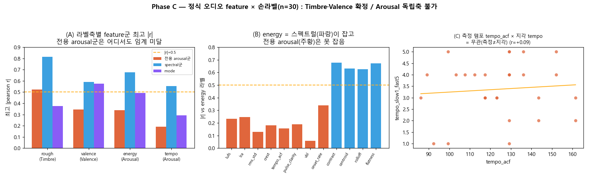

# EMOI-MAP 정서축 추출 연구 — Timbre·Valence·Arousal (Phase C)

> 작업 5(EMOI-MAP 좌표계 고찰) · 브랜치 `feature/emoi-starfield-timbre-valence` · 2026-07-07
> 선행: [cluster-map-extraction.md](cluster-map-extraction.md) · [B0 스크리닝](../working/report/cluster-energy-axis/README.md)
> 근거 레퍼런스: `docs/ref/Emotion Transition Model…pdf`(Russell/Thayer V-A 원형모델) · `docs/ref/audio_features_candidate.md`

## 1. 배경 — 왜 3정서축인가

EMOI-MAP은 밴드/곡을 2D에 배치한다. 현재 축을 음악감정 표준인 **Russell circumplex / Thayer mood model**
(각성 arousal × 정서가 valence)로 재해석하면:

| 지도 축 | feature | 정서 대응 | 손라벨 상관(기존) |
|---------|---------|-----------|-------------------|
| x | spectral **contrast** | **Timbre**(음색 거칢↔매끄러움) | rough r=−0.81 |
| y | **mode**(장/단조) | **Valence**(밝음↔어두움) | valence r=+0.51 |
| (없음) | — | **Arousal**(경쾌함/에너지) | energy·tempo 라벨 존재, 축 부재 |

Millsage·Ikka(1곡 밴드)가 귀와 어긋난 근본 원인은 **arousal 축 부재**(에너지 높은 곡을 timbre/valence로만
찍음)로 진단됐다. [Phase B0](../working/report/cluster-energy-axis/README.md)에서 onset 파생 feature로 arousal을
시도했으나 **전멸**(dyn.v가 곡별 정규화값이라 절대 강도 소실). 본 연구(Phase C)는 **원본 오디오에서 정식
feature**(LUFS·LRA·tempogram·VBL·HPSS 등)를 뽑아 세 축을 모두 정량 검증한다.

## 2. 방법

- **데이터**: 완비 로컬 `audio_full` 660곡(48kHz WAV). 검증은 **손라벨 n=30**(`axis_labels_worksheet.csv`,
  rough/valence/energy/tempo 1~5). 조인 = youtube id(url→vid).
- **추출**(`src/tools/cluster/phasec_features.py`, lean — demucs/f0 없이): 
  - *Arousal 후보*: `lufs`(pyloudnorm integrated) · `lra`(단기 loudness p95−p10, 정규화 불변) ·
    `rms_std`·`crest`(강도 변동, ESTM "강도의 변화") · `tempo_acf`(tempogram 자기상관) · `pulse_clarity` ·
    `vbl`(비트간격 분산, ESTM 식4 Variance-of-Beat-Length) · `onset_rate`.
  - *Valence 후보*: `mode_score`(Krumhansl) · `harmonic_ratio`(HPSS 협화도, 중앙45s excerpt≈전체·6배↑) ·
    `centroid` · `rolloff`.
  - *Timbre 후보*: `contrast` · `flatness` · `flux` · `zcr` · `rms`. (timbre()·mode_valence() 재사용.)
- **검정**(`phasec_correlate.py`): 후보 × 4 라벨축 Pearson/Spearman(n=30) + 기존 축 독립성 + 합성 valence 회귀.
- **판정**: |r|≥0.5(p<0.05); arousal은 추가로 기존 축과 독립(|r|≲0.4)해야 새 축 자격.
- 비용: 곡당 ~4.4s(테스트 30곡 2분13초). 진행률/pause/resume 인프라 = [B0](../working/report/cluster-energy-axis/README.md) 계승.

## 3. 결과

### 3.1 Timbre·Valence = 확정
| 축 | 최고 feature | pearson r | p |
|----|-------------|----------:|---:|
| **Timbre** | `contrast` × rough | **−0.815** | <0.001 |
| **Valence** | `mode_score` × valence | **+0.576** | 0.001 |

- 두 기존 축 모두 손라벨과 유의 정합 → **정식 feature로 재확증**. mode는 y(밝음)와 r=+0.986(항등 확인),
  x(contrast)와 −0.419로 대체로 독립 → 별개 축 자격 유지.
- **합성 Valence 미개선**: md 지침대로 `mode+centroid+harmonic_ratio` z회귀 → R=**+0.595** vs mode 단독 +0.576
  (가중치 mode 0.65·centroid 0.16·harmonic 0.12). 개선 <0.02 → **y=mode 유지**(합성 불채택).

### 3.2 Arousal = 독립축 불가 (핵심)
- **전용 arousal feature 전멸**: energy 라벨 최고 = `onset_rate` −0.338(p=0.068, 실패), tempo 라벨 최고 =
  `crest` +0.191(실패). LUFS(energy r=−0.23)·LRA(−0.25)·tempo_acf·VBL·rms_std 전부 임계 미달.
- **측정 템포 ≠ 지각 템포**(그림 C): `tempo_acf`(tempogram BPM) × 지각 tempo = **r=+0.087**, `tempo_librosa`
  =+0.039. 즉 오디오에서 잰 BPM은 사람이 느끼는 빠르기와 **무관**.
- **지각 energy/tempo는 "스펙트럴 밝기"가 설명**: energy와 `contrast −0.677·flatness +0.671·centroid +0.630·
  rolloff +0.625`, tempo와 `rolloff +0.554·contrast −0.537·centroid +0.527`. 밝고 거칠고 노이즈 많을수록
  "빠르고 격렬"하다고 느낀다.
- **그러나 독립이 아니다**: 그 스펙트럴 predictor들이 **기존 timbre 축과 collinear** — `centroid` r(x)=+0.520,
  `rolloff` r(x)=+0.546. 즉 지각 energy/tempo는 **contrast(밝기/공격성) 축에 얹혀** 있고, 새 차원이 아니다.

## 4. 해석 — "실질 1.x차원"의 확증
[cluster-correlation](../working/report/cluster-correlation/README.md)에서 제기된 **실질 1.x차원**(contrast가 여러
지각을 지배)이 정식 feature로 재현됐다. contrast 하나가 rough(−0.82)·energy(−0.68)·tempo(−0.54)·valence(+0.59)
**네 라벨 모두**와 상관한다. 이 오디오(BanG Dream — 대체로 크고 중~고속 밴드곡)에는 사실상 두 지각 차원만 있다:

1. **밝기/공격성**(contrast·centroid·rolloff·flatness 상호상관) — rough·energy·tempo 지각을 함께 몬다. = 현 x축.
2. **조성/정서**(mode) — valence를 몬다. 1과 대체로 독립. = 현 y축.

**독립 arousal 축은 없다.** 이 장르에선 "경쾌함/에너지"가 절대음량·BPM이 아니라 **음색 공격성**으로 지각되고,
그건 곧 timbre 축이다. 절대 LUFS는 마스터링/플랫폼 평준화로 뭉치고(std~1.8LU), 측정 BPM은 지각과 무관하다.

## 5. 결정
- **축 유지**: x=**Timbre**(contrast) · y=**Valence**(mode) — 둘 다 정식 feature로 검증됨. 변경 없음.
- **Arousal 새 축 도입 안 함**(테스트 불합격). 따라서 **전곡 660 arousal 추출은 불요**(축 구축 근거 없음).
- **Millsage·Ikka**는 측정으로 해결 불가 확정 → [Phase A overrides](../working/HANDOFF.md)(millsage dx=−18·ikka
  dy=+18, n≥5 만료)가 최종 처방으로 유지. 별 밝기=energy 채널은 밝기≈contrast라 x축과 다소 중복(장식 유지).
- **합성 valence 불채택**(개선 미미).

## 6. 데이터 보관 (사용자 요청 — 폐기 금지)
- `docs/working/report/emotion-axes/phasec_features.csv`(라벨 30곡 정식 feature 18열) — **커밋 보존**, 재사용.
- `phasec_correlation.{txt,json}` · `phasec_screening.png` — 결과 보존.
- B0 데이터(`cluster-energy-axis/onset_features.csv` 660) — 별 브랜치에 보존됨.
- `audio_full`(660·15GB) — 로컬 보존(gitignore). 향후 feature 재설계 시 원본 재사용.
- 도구 재사용: `phasec_features.py`(--full 전곡 추출 가능·진행/pause) · `phasec_correlate.py` · `phasec_plot.py`.

## 7. 다음 (선택지)
- (a) **현 2축으로 확정 종료** — 연구가 "이 오디오의 정서 상한 = timbre×valence"를 확립. 가장 정합적.
- (b) **전곡 660 정식 feature 추출**(≈46분) — 새 축은 못 되지만 centroid/rolloff/LRA/harmonic 등 풍부한
  파생을 audio_map에 부기해 두면 향후 탐색·필터·정렬에 재활용(데이터 보관 취지). 축 구축은 아님.
- (c) **라벨 확대 재도전** — arousal이 정말 없는지 n을 늘려 재검(단 부호·독립성 문제상 반전 가능성 낮음).
- (d) **장르 밖 대조군** — 발라드~고속곡 스펙트럼이 넓은 외부곡으로 arousal 분리 가능성 확인(범위 밖).
