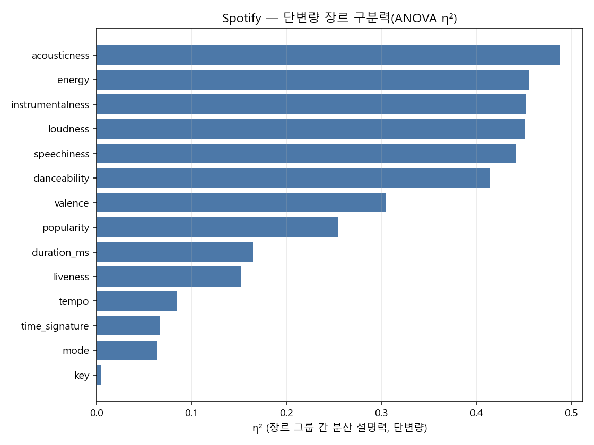
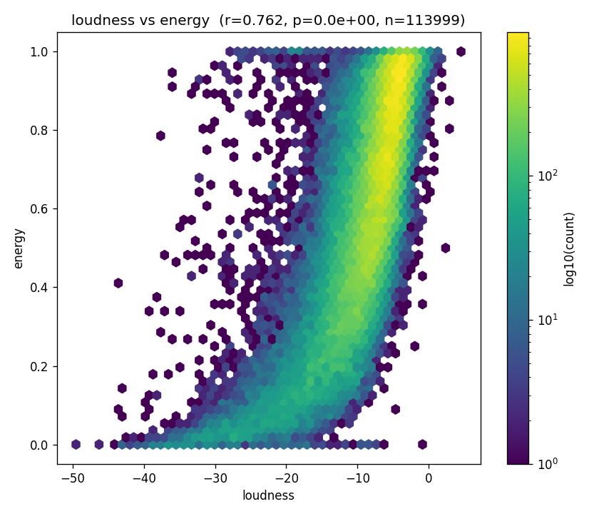
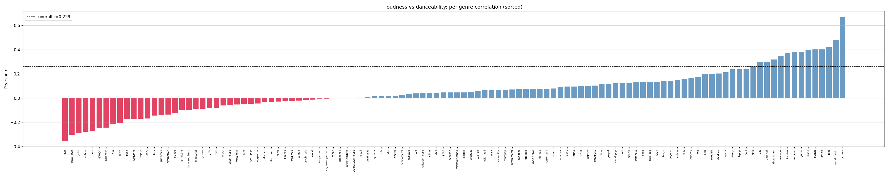
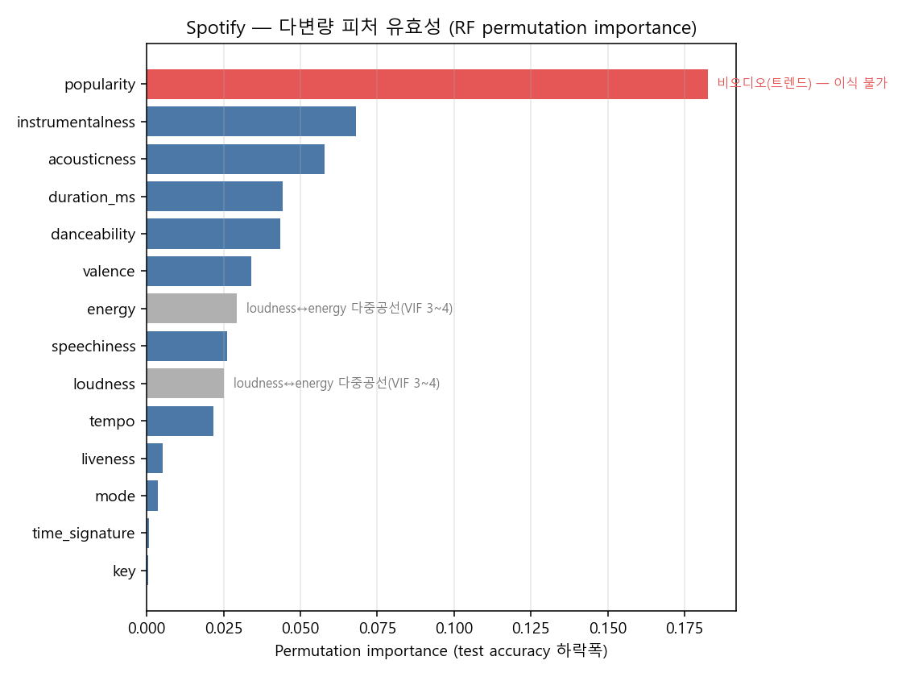
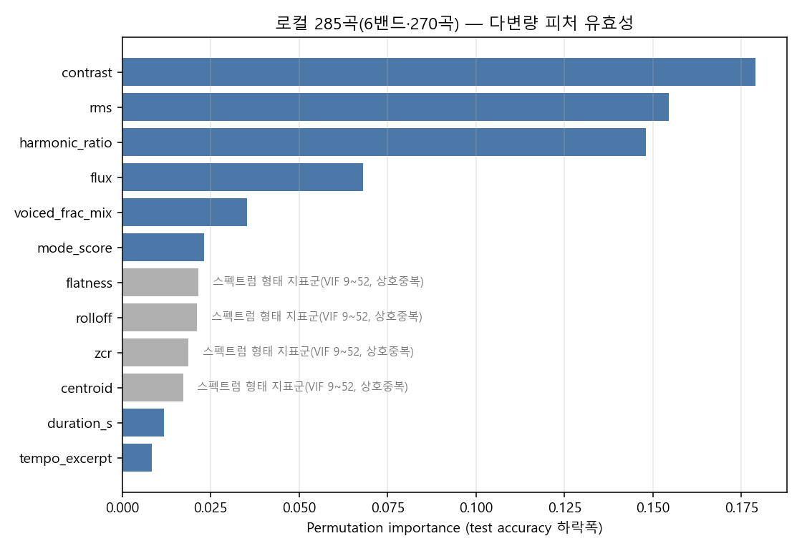

# Spotify 114,000곡에서 로컬 285곡까지 — 단변량 유효성에서 다변량 유효성 검증으로

## 초록 (Abstract)

Spotify Tracks Dataset(114,000행·114장르)으로 "어떤 오디오 변수가 장르(≈편성)를 잘 가르는가"를 물었다. 처음엔 단변량(ANOVA η²)·이변량(pairwise correlation) 관점에서 `acousticness`·`energy`·`instrumentalness`가 상위권이었지만, `loudness`↔`energy`의 강한 상관(r=0.762)이 진짜 두 개의 독립 신호인지 하나가 중복인지는 이 관점만으로 구분할 수 없었다. VIF(다중공선성)와 RandomForest permutation importance를 더한 다변량 검증을 도입하자 `energy`/`loudness`의 개별 기여도가 큰 폭으로 떨어지고, 반대로 `popularity`(비오디오 변수)가 다변량 1위로 뛰어오르는 반전이 나타났다. 같은 방법론을 로컬 285곡(6밴드·270곡, 우리 손으로 재정의한 프록시)에 적용하자 스펙트럼 형태 지표군(`centroid`/`rolloff`/`zcr`/`flatness`)에서 동일한 다중공선 패턴이 재현됐고, `energy_proxy`의 세 구성 성분(`rms`·`contrast`·`flux`)이 정확히 다변량 상위권과 일치한다는 사후 검증을 얻었다. 결론은 EMOI-MAP 프록시 우선순위 후보 목록(harmonic_ratio 확정 사용 → energy_proxy 3성분 유지 → instrumentalness 측정 개선)이며, 최종 축 개편은 전곡(660곡) 캐시로 재검증한 뒤 결정한다.

## 1. 동기 (Motivation)

EMOI-MAP은 밴드를 2D(x=timbre/contrast, y=valence/mode)에 배치하는데, 이 축을 정의한 신호처리 피처가 "장르/편성 구분력"이 있다는 근거는 지금까지 우리 로컬 코퍼스 내부의 상관·분포 관찰([emotion-axes-extraction.md](emotion-axes-extraction.md))에 국한돼 있었다. 로컬 코퍼스는 660곡·소수 밴드뿐이라, "이 피처가 장르를 가르는 데 원래 유용한 종류의 신호인가"를 표본이 훨씬 큰 외부 데이터로 먼저 교차검증해볼 필요가 있었다. Spotify Tracks Dataset은 114,000곡·114장르로 표본이 충분하고, `acousticness`/`energy`/`instrumentalness` 같은 우리가 로컬에서 재정의한 프록시의 "원조 개념"을 담고 있어 방법론 시험대로 적합했다.

첫 단변량 분석(η²)에서 `loudness`↔`energy`가 둘 다 상위권으로 나왔을 때, 사용자가 "둘이 강하게 상관하는 건 어떻게 보면 당연한 결과"라는 정성적 판단을 제기했다. 그 판단 자체는 배제하고 정량적으로 파고들자는 요청이 이 연구의 전환점이 됐다 — "당연해 보이는 상관"을 단변량 순위에서 그냥 넘기지 않고, 다중공선성이 실제로 개별 변수의 다변량 기여도를 얼마나 깎아먹는지 직접 재보기로 한 것이다.

## 2. 재료와 방법 (Materials & Methods)

### 2.1 데이터
- **Spotify Tracks Dataset**: `side-project/spotify-tracks-dataset/data/dataset.csv`, 114,000행 → 결측치/`duration_ms==0` 제거 후 113,999행·114장르. 21컬럼 중 오디오 관련 14개를 저수준(6)·합성(7)·모델예측(1, `popularity`) 3그룹으로 분류([metadata.md](../../side-project/spotify-tracks-dataset/data/metadata.md)).
- **로컬 오디오**: `docs/working/report/genre-features/song_features_with_proxies.csv`, 285곡·10밴드(전곡 660 중 로컬 부분 캐시). 표본수 20 미만 밴드(pastel_palettes=8·various_artists=5·millsage=1·ikka_dumb_rock=1) 제외 후 **6밴드·270곡**만 다변량 검증에 사용.

### 2.2 지표
- **단변량**: `scipy.stats.f_oneway` one-way ANOVA + η²(=SS_between/SS_total) — "장르/밴드가 이 변수의 분산을 얼마나 설명하는가."
- **이변량**: Pearson r(전체) + 장르/밴드별로 쪼갠 r의 분산 — 전체 상관과 그룹 내 상관이 어긋나는 경우(Simpson's paradox류) 포착.
- **다변량**:
  - VIF(분산팽창지수, `statsmodels` 미설치로 직접 계산: `VIF_i = 1/(1-R²_i)`, R²_i = 나머지 피처로 피처 i를 회귀했을 때 결정계수) — 피처 간 중복(다중공선성) 사전 확인.
  - RandomForestClassifier(장르/밴드 ~ 피처들) 학습 후 **permutation_importance**(test set, accuracy 하락폭) — "이 피처를 무작위로 섞으면 정확도가 얼마나 떨어지는가," impurity 기반 중요도보다 편향이 적음.
  - 판정 기준: VIF가 낮으면서(≲3) permutation importance가 상위면 "고유 정보," VIF가 높은데(≳3) permutation importance가 낮으면 "중복(무효 아님)."

## 3. 실험 여정 (Experiments, in order)

### Exp 0 — Spotify 장르별 ANOVA/η² (단변량) 🎯
`violin_genre_vs_audiofeats.py`로 14개 변수 각각의 장르 구분력을 η²로 정량화. 상위 6개 중 5개가 합성(composite) 변수(`acousticness` 0.488·`energy` 0.455·`instrumentalness` 0.452·`speechiness` 0.442·`danceability` 0.415)였고, 저수준 변수 중 유일하게 `loudness`(0.451)가 상위권에 끼었다. `key`(0.005)·`mode`(0.063)·`time_signature`(0.067)는 장르와 거의 무관. → [report-genre_audio_features.md](../../side-project/spotify-tracks-dataset/report-genre_audio_features.md).



### Exp 1 — 변수쌍 상관(이변량), Simpson's paradox 발견 ⚠️
`scatter_pairwise.py`로 55개 변수쌍의 전체 Pearson r + 장르별 r을 비교. `loudness`↔`energy`가 r=+0.762로 압도적 1위(★그림1) — 사용자가 "당연한 결과"라 지적한 지점. 그러나 `loudness`↔`danceability`(전체 r=+0.259)는 **114개 장르 중 39개에서 부호가 반전**되고(★그림5), `tempo`↔`danceability`도 20개 장르에서 반전됐다 — 전체 상관 하나만 보면 "약한 관계"로 오판할 수 있다는 방법론적 경고. → [report-pairwise_scatter.md](../../side-project/spotify-tracks-dataset/report-pairwise_scatter.md).




### Exp 2 — Spotify 다변량 유효성 검증(VIF+RF+PI), 첫 시행착오 ⚠️
최초 파라미터(`n_estimators=300, max_depth=None` + `permutation_importance(n_repeats=10, n_jobs=1)`)로 실행했는데 **37분이 지나도 끝나지 않았다**(메모리는 72MB로 낮아 OOM은 아니고, 완전 성장 트리 + 단일스레드 permutation importance가 병목). "데이터 구조를 대변하는 정도면 되고 과적합을 오히려 경계해야 한다"는 지적에 따라 `n_estimators=150, max_depth=15, min_samples_leaf=10` + `permutation_importance(n_repeats=5, n_jobs=-1)`로 규제하자 수 분 내 완료됐다 — 방법 자체의 문제가 아니라 파라미터가 과했던 것으로 확인.

### Exp 3 — Spotify 다변량 결과: 예상된 반전과 예상 밖 반전 🎯
규제된 모델로 test accuracy 0.3234(chance 0.0088의 약 37배). Permutation importance에서:
- **예상된 반전**: `energy`(0.029, 7위)·`loudness`(0.025, 9위)가 단변량 순위(2위·4위)보다 크게 밀렸다 — VIF(4.05/3.09)로 이미 확인한 다중공선성이 정확히 예상한 방식으로 나타났다.
- **예상 밖 반전**: `popularity`가 permutation importance 1위(0.183)로 뛰어올랐다(단변량 8위·이변량 |r|<0.1이었는데도). 다만 이는 popularity가 오디오 신호가 아니라 트렌드/수요 기반 산출물이라 애초에 다른 오디오 변수와 공선성이 가장 낮으리라는 것(VIF 1.02, 전체 최저)까지는 사전 예측 가능했던 결과였다.
- **일관된 견고함**: `acousticness`(3위, VIF 2.28)·`instrumentalness`(2위, VIF 1.43)는 단변량·다변량 모두 상위 — 중복 없는 고유 신호. → [report-feature_validity.md](../../side-project/spotify-tracks-dataset/report-feature_validity.md).



### Exp 4 — 동일 방법을 로컬 285곡에 적용 🎯
`src/tools/cluster/genre_features_validity_rf.py`로 로컬 6밴드·270곡에 같은 방법을 적용. 처음엔 프록시(`acousticness_proxy` 등)와 그 원재료(`harmonic_ratio`·`flatness` 등)를 함께 넣었더니 **VIF가 전부 `inf`**로 나왔다 — 프록시가 원재료의 정확한 선형결합이라 설계행렬이 완전 특이(rank-deficient)해진 것으로, "중복"이 아니라 산술적으로 당연한 결과라 해석에 쓸모가 없었다. 원본 신호처리 피처 12개만으로 재실행하자 정상적인 VIF 분포(1.09~51.65)를 얻었다.

결과(test accuracy 0.7206, chance 0.1667의 약 4.3배): 스펙트럼 형태 지표군(`centroid` VIF 51.65·`rolloff` 27.61·`zcr` 16.35·`flatness` 9.16)이 서로 강하게 겹치고 permutation importance는 넷 다 최하위권(0.017~0.022) — Spotify의 `loudness`↔`energy` 패턴이 로컬에서도 재현됐다. 반면 `contrast`(0.179)·`rms`(0.154)·`harmonic_ratio`(0.148)·`flux`(0.068)는 VIF가 낮으면서 압도적으로 높은 permutation importance를 보였다. → [genre-features/README.md](../working/report/genre-features/README.md).



## 4. 전환점 (Turning point)

두 지점이 이 연구의 방향을 바꿨다.

1. **"당연한 상관"을 정량화하자는 요청** — `loudness`↔`energy`가 상관관계가 있다는 건 직관적으로 자명하지만, "그래서 다변량 모델에서 개별 기여도가 실제로 얼마나 깎이는가"는 VIF+permutation importance를 붙이기 전까지 몰랐다. 이 요청이 없었다면 Exp 0(단변량)·Exp 1(이변량) 수준에서 분석이 종료됐을 것이고, `energy`/`loudness`가 실제로는 중복 신호라는 사실도, `popularity`의 반전도 발견하지 못했을 것이다.
2. **로컬 데이터에서 프록시+원재료를 함께 넣었다가 VIF가 전부 `inf`로 나온 시점** — 이 실패가 "프록시는 이미 알려진 선형결합이니 원재료만 검증하면 된다"는 실험 설계 원칙을 확정지었고, 그 덕분에 `energy_proxy`의 3성분(rms·contrast·flux)이 실제로 상위 permutation importance와 정확히 일치한다는(사후) 검증을 얻을 수 있었다.

## 5. 최종 방법과 구현 (Final Method)

**채택 (Adopted)**: 피처 유효성 검증은 항상 **단변량(η²) → 이변량(pairwise r, 그룹별 분산 포함) → 다변량(VIF + RF permutation importance)** 3단계로 진행한다. 다변량 단계에서:
- 프록시(합성식으로 만든 변수)와 그 원재료를 함께 넣지 않는다 — 정확한 선형결합이면 VIF가 퇴화(`inf`)한다.
- 표본 크기에 맞게 RandomForest를 규제한다 — Spotify(114,000행)는 `max_depth=15, min_samples_leaf=10`, 로컬(270행)은 `max_depth=6, min_samples_leaf=5`. "최고 성능 분류기"가 아니라 "데이터 구조를 대변하는 정도"가 목표.
- 표본수가 클래스당 기준치(로컬 기준 20곡) 미만인 그룹은 stratified split 이전에 제외한다.

**교차검증으로 확정한 EMOI-MAP 프록시 후보 우선순위**:
1. `harmonic_ratio`(acousticness 축 핵심 신호) — 확정 사용.
2. `rms`+`contrast`+`flux`(energy_proxy 3성분 유지, 단일 스칼라로 뭉치지 않음).
3. `instrumentalness`(원재료 `voiced_frac_mix`) — 개념은 유효하나 측정(Demucs 미적용)이 약함, 개선 후 재판단.

## 6. 한계 (Limitations)

- **표본 크기 비대칭**: Spotify(113,999행)와 로컬(270행)은 400배 이상 차이 나, 로컬 permutation importance의 표준편차가 상대적으로 크다(`feature_validity_importance.csv` 참고) — 순위 자체보다 "상위 4개 vs 하위 8개" 같은 큰 격차 구간 구분 정도로만 신뢰해야 한다.
- **부분 캐시**: 로컬은 전곡 660 중 285곡(10밴드)만 존재하고, 그중 6밴드·270곡만 다변량 검증에 썼다. 헤비메탈 계열 밴드(Roselia 등)가 빠져 있어 "메탈 vs 어쿠스틱" 대비를 온전히 검증하지 못했다.
- **instrumentalness_proxy는 약한 대체재**: Demucs/torch 미설치로 보컬분리 없이 믹스에서 직접 측정 — 리드 악기(기타 솔로 등)에 오염될 수 있다.
- **energy_proxy 가중치는 균등(1:1:1) z-합** — 이번 검증은 "구성 성분 선택"이 타당했음을 보였을 뿐, 최적 가중치는 검증하지 않았다.
- **최종 결론 아님**: 이 문서의 우선순위는 로컬 부분 캐시(285/660) 기준 잠정 결론이며, **다른 로컬·세션에서 전곡(660곡) 캐시로 동일 방법(VIF+RF+PI)을 재실행해 확인한 뒤에만 EMOI-MAP 축/프록시 설계를 개편**한다. 이 연구 자체에서는 EMOI-MAP 소스를 변경하지 않았다.

## 7. 재현 (Reproduction)

```bash
# Spotify 분석(단변량 → 이변량 → 다변량), base env(pandas/scikit-learn/scipy)
python side-project/spotify-tracks-dataset/violin_genre_vs_audiofeats.py
python side-project/spotify-tracks-dataset/scatter_pairwise.py
python side-project/spotify-tracks-dataset/feature_validity_rf.py

# 로컬 오디오 다변량 검증(로컬 전용 자산 — song_features_with_proxies.csv,
# hummingbird env로 사전 추출된 285곡 로컬 캐시 필요), base env
python src/tools/cluster/genre_features_validity_rf.py
```

---

*작성 2026-07-08 · 브랜치 `analysis/audio-feats`*
