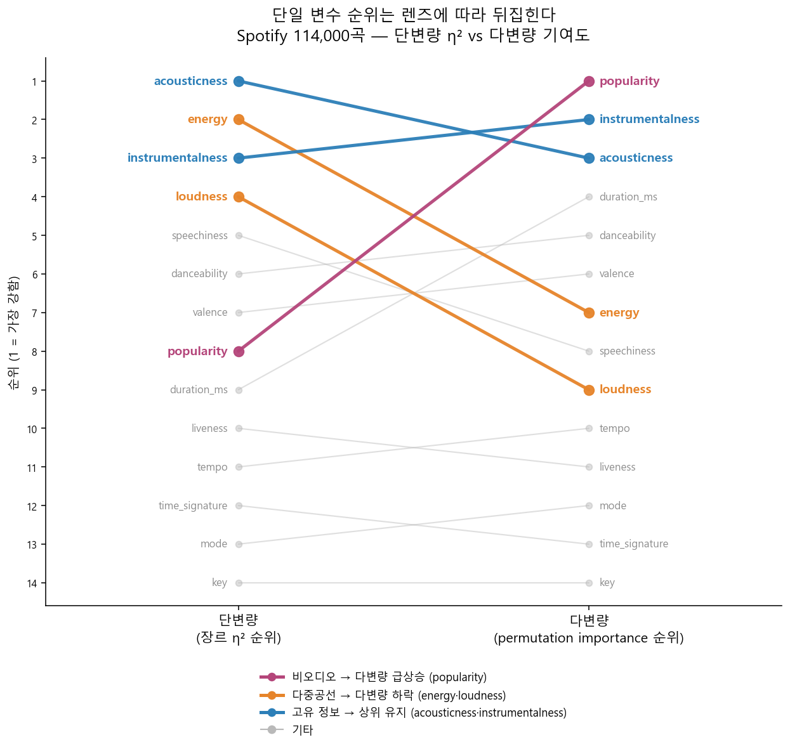
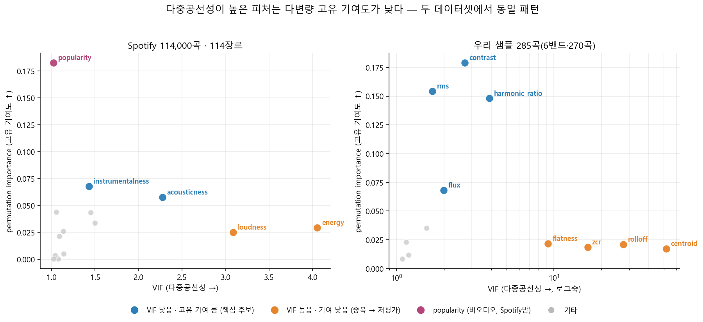

# 한 변수씩 보면 놓친다 — Spotify 114,000곡과 우리 285곡으로 본, 오디오 피처의 장르 구분력 (단·이·다변량 3중 렌즈)

## 초록 (Abstract)

"어떤 오디오 피처가 장르(≈편성/스타일)를 잘 가르는가"는 단순한 순위 문제처럼 보이지만, **어떤 렌즈로 보느냐에 따라 답이 뒤집힌다.** 공개 데이터 Spotify Tracks Dataset(114,000곡·114장르)에 세 렌즈를 차례로 댔다. ① 단변량(장르별 ANOVA η²)에서는 `acousticness`·`energy`·`instrumentalness`·`loudness`가 상위였다. ② 이변량(변수쌍 상관)에서 `loudness`↔`energy`가 r=+0.762로 압도적이라, 앞의 상위권 중 둘이 사실상 같은 신호일 가능성이 드러났고, 동시에 여러 쌍에서 전체 상관과 장르 내부 상관의 부호가 뒤집히는 집계 역설(Simpson's paradox)이 나타났다. ③ 다변량(VIF + RandomForest permutation importance)에서 `energy`/`loudness`의 개별 기여도가 급락하고(중복 → 저평가), 반대로 오디오와 무관한 `popularity`가 1위로 치솟는 반전이 나왔다. 같은 3중 렌즈를 **우리 로컬 샘플 285곡(6밴드·270곡)**에 그대로 적용하자, 스펙트럼 형태 지표군(`centroid`/`rolloff`/`zcr`/`flatness`)에서 동일한 다중공선 → 저평가 패턴이 재현됐고, 우리가 임의 결합으로 만든 `energy_proxy`의 세 성분(`rms`·`contrast`·`flux`)이 정확히 다변량 상위권과 일치한다는 사후 검증을 얻었다. 결론은 방법론적("단일 변수 순위를 그대로 믿지 말고 3중 렌즈를 겹쳐라")이자 실용적(EMOI-MAP 프록시 우선순위: `harmonic_ratio` 확정 → `energy_proxy` 3성분 유지 → `instrumentalness` 측정 개선)이다. 최종 축 개편은 전곡(660곡) 캐시 재검증 후 별도 세션에서 결정한다.

## 1. 동기 (Motivation)

EMOI-MAP은 밴드/곡을 2D(x=timbre/contrast, y=valence/mode)에 배치한다. 이 축을 정의한 신호처리 피처가 "장르/편성 구분력이 있는 종류의 신호"라는 근거는 지금까지 우리 로컬 코퍼스 내부 관찰([emotion-axes-extraction.md](emotion-axes-extraction.md))에 국한돼 있었다. 로컬은 660곡·소수 밴드뿐이라, "이 피처가 원래 장르를 가르는 데 유용한가"를 표본이 훨씬 큰 외부 데이터로 먼저 교차검증할 필요가 있었다. Spotify Tracks Dataset은 114,000곡·114장르로 표본이 충분하고, `acousticness`/`energy`/`instrumentalness`처럼 우리가 로컬에서 재정의한 프록시의 "원조 개념"을 담고 있어 방법 시험대로 적합했다.

결정적 계기는 첫 단변량 결과에서 왔다. `loudness`와 `energy`가 나란히 상위로 나왔을 때, "둘이 강하게 상관하는 건 어떻게 보면 당연한 결과"라는 정성적 지적이 제기됐다. 그 정성적 판단 자체는 배제하되 — **"당연해 보이는 상관"을 순위표에서 그냥 넘기지 말고, 그 중복이 실제로 각 변수의 기여도를 얼마나 깎아먹는지 정량적으로 재보자**는 방향이 이 연구의 척추가 됐다. 단변량 순위 하나로 끝냈다면 결코 보지 못했을 것들(중복의 대가, `popularity`의 반전, 집계 역설)이 렌즈를 더할 때마다 드러났다.

## 2. 재료와 방법 (Materials & Methods)

### 2.1 데이터
- **공개 벤치마크 — Spotify Tracks Dataset**: `side-project/spotify-tracks-dataset/data/dataset.csv`, 114,000행 → 결측치/`duration_ms==0` 제거 후 **113,999행·114장르**. 21컬럼 중 오디오 관련 14개를 **저수준**(6: `duration_ms`·`key`·`mode`·`loudness`·`tempo`·`time_signature`) · **합성**(7: `danceability`·`energy`·`speechiness`·`acousticness`·`instrumentalness`·`liveness`·`valence`) · **모델예측**(1: `popularity`) 3그룹으로 분류([metadata.md](../../side-project/spotify-tracks-dataset/data/metadata.md)). 합성 변수는 Spotify의 블랙박스 ML 산출물이라 값 자체는 이식 불가, 개념만 참고.
- **우리 샘플 — 로컬 오디오 프록시**: `side-project/genre-features/song_features_with_proxies.csv`, 285곡·10밴드(전곡 660 중 로컬 부분 캐시). 밴드를 장르/편성의 대리 변수로 사용. 다변량 검증에는 표본수 20 미만 밴드(pastel_palettes 8·various_artists 5·millsage 1·ikka_dumb_rock 1)를 제외한 **6밴드·270곡**(afterglow 65·hello_happy_world 65·morfonica 50·mygo 41·ave_mujica 26·mugendai_mutype 23)만 사용.

### 2.2 지표 (무엇으로 합격을 판정하는가)
- **단변량 — 장르별 ANOVA η²**(`scipy.stats.f_oneway` + η²=SS_between/SS_total): "장르/밴드가 이 변수의 분산을 얼마나 설명하는가." 값이 클수록 단독으로 그룹을 잘 가른다.
- **이변량 — Pearson r**(전체 + 그룹별): 두 변수의 선형 연관. 전체 상관과 그룹 내부 상관이 어긋나는 경우(집계 역설)를 잡기 위해 장르/밴드별 r의 분포·부호반전 수도 함께 본다.
- **다변량 — VIF + RandomForest permutation importance**:
  - VIF(분산팽창지수, `statsmodels` 미설치로 직접 계산 `VIF_i = 1/(1-R²_i)`): 한 피처가 나머지 피처로 얼마나 예측되는가 = 중복도. VIF↑ = 다른 피처로 대체 가능 = 중복.
  - RandomForestClassifier(장르/밴드 ~ 피처들) 학습 후 permutation importance(test set, accuracy 하락폭): "이 피처를 무작위로 섞으면 정확도가 얼마나 떨어지는가" = 다른 피처가 대신 못 하는 **고유** 기여. impurity 기반 중요도보다 편향이 적다.
  - **판정 규칙**: VIF 낮음(≲3) + PI 상위 = "고유 정보(진짜 신호)". VIF 높음(≳3) + PI 낮음 = **"무효가 아니라 중복"**(둘 중 하나만 있어도 나머지를 대신 씀). VIF+PI를 반드시 같이 봐야 이 구분이 가능하다.

## 3. 실험 여정 (Experiments, in order)

### Exp 0 — Spotify 단변량 η²: 합성 변수가 강하다 🎯
`violin_genre_vs_audiofeats.py`로 14개 변수의 장르 구분력을 η²로 정량화. 상위 6개 중 5개가 합성 변수(`acousticness` 0.488·`energy` 0.455·`instrumentalness` 0.452·`speechiness` 0.442·`danceability` 0.415)였고, 저수준 중 유일하게 `loudness`(0.451)가 상위권에 끼었다. `key`(0.005)·`mode`(0.063)·`time_signature`(0.067)는 장르와 거의 무관. **순진한 결론**: "장르 판별엔 합성 오디오 서술자가 최고." 그러나 `loudness`와 `energy`가 나란히 상위라는 점이 의심의 씨앗이 됐다 — 두 개의 독립 신호인가, 하나인가? → [report-genre_audio_features.md](../../side-project/spotify-tracks-dataset/report-genre_audio_features.md).


### Exp 1 — Spotify 이변량: 중복의 증거 + 집계 역설 ⚠️
`scatter_pairwise.py`로 그룹 간 55개 변수쌍의 전체 Pearson r + 장르별 r을 비교.
- **중복의 직접 증거**: `loudness`↔`energy` r=+0.762로 압도적 1위(그림). `loudness`↔`acousticness` −0.590·`loudness`↔`instrumentalness` −0.433 — 저수준 `loudness` 하나가 여러 합성 변수의 원료로 쓰였을 정황. 즉 Exp 0에서 나란히 높던 `loudness`·`energy`는 상당 부분 **같은 정보**였다.
- **`popularity`는 오디오와 무관**: 어떤 오디오 변수와도 |r|<0.1(`energy`↔`popularity`는 r=0.001, p=0.72로 사실상 무상관) — 오디오 신호가 아니라 재생 이력 기반 값임을 재확인.
- **집계 역설(Simpson's paradox)**: `loudness`↔`danceability`는 전체 r=+0.259지만 **114장르 중 39개에서 부호가 반전**(dub −0.35 ~ german +0.67, 그림). `tempo`↔`danceability`는 20개, `duration_ms`↔`instrumentalness`는 43개 장르에서 반전. **"전체 상관이 약하다 = 두 변수가 무관하다"고 단정하면 안 된다** — 그룹 내부엔 강한(때론 반대 방향의) 구조가 숨어 있다. → [report-pairwise_scatter.md](../../side-project/spotify-tracks-dataset/report-pairwise_scatter.md).


### Exp 2 — Spotify 다변량, 첫 시행착오: 파라미터가 과했다 ⚠️
VIF+RF+permutation importance를 붙이러 갔는데, 최초 파라미터(`n_estimators=300, max_depth=None`(완전 성장) + `permutation_importance(n_repeats=10, n_jobs=1)`)로 **37분이 지나도 끝나지 않았다**. 메모리는 72MB로 낮아 OOM은 아니었고, 완전 성장 트리(114클래스에 불필요하게 깊음) + 단일스레드 permutation importance가 병목이었다. 목적은 "최고 성능 분류기"가 아니라 "데이터 구조를 대변하는 정도의 모델"(오히려 과적합을 경계해야 함)이므로, `n_estimators=150, max_depth=15, min_samples_leaf=10` + `permutation_importance(n_repeats=5, n_jobs=-1)`로 규제하자 수 분 내 완료. **방법의 문제가 아니라 파라미터의 문제**였다.

### Exp 3 — Spotify 다변량 결과: 순위가 뒤집힌다 🎯
규제된 모델로 test accuracy 0.3234(chance 0.0088의 약 37배)·top-5 0.6749(top-1과의 격차 = 인접 장르 경계가 흐릿함). VIF와 permutation importance를 겹쳐 보면:
- **VIF**: `energy`(4.05)·`loudness`(3.09)만 눈에 띄게 높고 나머지는 <2.3, `popularity`가 최저(1.02). Exp 1의 r=0.762가 다중공선성으로 확증됐다.
- **예상된 반전**: `energy`가 단변량 2위 → 다변량 7위(PI 0.029), `loudness`가 4위 → 9위(0.025). 둘이 서로 대체 가능해 개별 기여가 저평가된 것 — **"무효"가 아니라 "중복"**. 반면 `acousticness`(3위, VIF 2.28)·`instrumentalness`(2위, VIF 1.43)는 상위 유지 = 중복 없는 고유 신호.
- **예상 밖 반전**: `popularity`가 단변량 8위·이변량 |r|<0.1이었는데 **다변량 1위(0.183)**로 치솟았다. 오디오 변수와 선형관계는 없지만 장르별 비선형 인기도 분포를 RF가 이용한 것. 다만 이는 popularity가 트렌드/수요 산물이라 애초에 오디오와 공선성이 가장 낮으리라(VIF 1.02) 예측 가능했던 결과이고, **우리 프로젝트엔 이식할 수도 없어**(로컬 오디오에서 유도 불가) 실질적 관심 대상은 아니다.

아래 slope 그림이 이 연구의 핵심 주장을 한 장으로 압축한다 — **같은 데이터, 같은 14개 변수인데 렌즈만 바꿔도 순위가 통째로 뒤집힌다.** → [report-feature_validity.md](../../side-project/spotify-tracks-dataset/report-feature_validity.md).




### Exp 4 — 우리 샘플에 이식, 두 번째 함정: 프록시+원재료 = VIF 폭발 ⚠️
같은 방법을 로컬 6밴드·270곡에 적용(`src/tools/cluster/genre_features_validity_rf.py`). 처음엔 프록시(`acousticness_proxy` 등)와 그 원재료(`harmonic_ratio`·`flatness` 등)를 함께 넣었더니 **VIF가 대부분 `inf`**로 나왔다. 프록시가 원재료의 **정확한 선형결합**(예: `acousticness_proxy = z(harmonic_ratio) − z(flatness)`)이라 설계행렬이 완전 특이(rank-deficient)해진 것 — "중복"이 아니라 산술적으로 당연한 결과라 해석 불가. 이 실패가 "프록시는 이미 알려진 선형결합이니 **원본 신호처리 피처 12개만** 검증 대상으로 삼는다"는 설계 원칙을 확정지었다.

### Exp 5 — 우리 샘플 다변량 결과: Spotify 패턴이 재현된다 🎯
원본 12피처로 재실행(test accuracy 0.7206, chance 0.1667의 약 4.3배; `n_estimators=200, max_depth=6, min_samples_leaf=5`로 처음부터 가볍게 규제 — Exp 2의 교훈).
- **다중공선 → 저평가 패턴 재현**: 스펙트럼 형태 지표군 `centroid`(VIF 51.65)·`rolloff`(27.61)·`zcr`(16.35)·`flatness`(9.16)가 서로 강하게 겹치고 permutation importance는 넷 다 최하위권(0.017~0.022). Spotify의 `loudness`↔`energy`(한 쌍)와 달리 로컬에선 스펙트럼 밝기 지표 **넷**이 한꺼번에 얽혔다(전부 "스펙트럼이 얼마나 밝고 납작한가"를 다르게 잰 것) — 데이터셋은 달라도 **"중복이면 다변량에서 저평가된다"는 메커니즘은 동일.**
- **고유 신호**: `contrast`(0.179)·`rms`(0.154)·`harmonic_ratio`(0.148)·`flux`(0.068)가 VIF 낮으면서 압도적 상위 = 밴드 판별의 핵심 4개.
- **프록시 설계의 사후 검증**: 우리가 임의 균등 결합으로 만든 `energy_proxy = z(rms)+z(contrast)+z(flux)`의 **세 성분이 정확히 이 상위 4개 중 셋과 일치**한다 — 가중치 최적화 여부와 별개로, 성분 선택 자체는 데이터로 뒷받침됐다. 반면 `acousticness_proxy = z(harmonic_ratio) − z(flatness)`는 두 성분 기여가 크게 비대칭(`harmonic_ratio` 0.148 vs `flatness` 0.022)이라 사실상 `harmonic_ratio` 단독이 이끈다. → [genre-features/README.md](../../side-project/genre-features/README.md).


아래 그림이 두 데이터셋을 한 좌표에 놓고 **"다중공선성(VIF)이 높은 피처일수록 다변량 고유 기여도(PI)가 낮다"**는 공통 메커니즘을 보여준다 — 우리 샘플(오른쪽)에서 특히 선명하다.



## 4. 전환점 (Turning point)

세 순간이 방향을 바꿨다.
1. **"당연한 상관"을 정량화하자는 요청**(Exp 0→2): `loudness`↔`energy`가 상관인 건 자명하지만, "그래서 다변량 기여도가 실제로 얼마나 깎이는가"는 VIF+PI를 붙이기 전엔 몰랐다. 이 요청이 없었으면 단변량 순위에서 분석이 끝났을 것이다.
2. **프록시+원재료 VIF=`inf` 실패**(Exp 4): 이 실패가 "원본 피처만 검증" 원칙을 확정했고, 덕분에 `energy_proxy` 3성분이 실제 상위 PI와 일치한다는 사후 검증을 얻었다.
3. **Simpson's paradox 발견**(Exp 1): "전체 상관 하나로 무관을 단정하지 말라"는 방법론적 경고가, 나중에 우리 밴드별 프록시 상관을 볼 때도 전체값만 보면 안 된다는 지침으로 이어졌다.

## 5. 최종 방법과 구현 (Final Method)

**채택 (Adopted) — 피처 유효성 검증 3중 렌즈 프로토콜**: 앞으로 오디오 피처의 그룹 구분력을 평가할 때는 항상 **단변량(η²) → 이변량(전체 + 그룹별 Pearson r) → 다변량(VIF + RF permutation importance)** 순으로 겹쳐 본다. 단일 렌즈 결과는 오해를 부른다(중복을 유효로, 유효를 무효로, 무관을 유관으로 오판). 다변량 단계에서:
- 프록시(합성식 변수)와 그 원재료를 **함께 넣지 않는다**(정확한 선형결합이면 VIF 퇴화).
- RandomForest를 **표본 크기에 맞게 규제**한다(Spotify 113,999행: `max_depth=15, min_samples_leaf=10`; 로컬 270행: `max_depth=6, min_samples_leaf=5`). 목표는 최고 성능이 아니라 구조 대변 + 과적합 회피.
- 클래스당 표본이 기준치(로컬 20곡) 미만인 그룹은 stratified split 전에 제외.

**교차검증으로 도출한 EMOI-MAP 프록시 후보 우선순위**(세 그룹):
- **① 양쪽에서 강함(가장 신뢰)**: `acousticness`(실 신호 `harmonic_ratio` — Spotify η² 1위·다변량 3위, 로컬 다변량 3위) 확정 사용, 단 `flatness` 성분은 기여 미미해 보조로 강등. `energy`는 "단일 스칼라(≈loudness)"로 뭉치면 정보가 얇지만 `rms`+`contrast`+`flux`로 **분해하면 세 축 모두 살아있음** — `energy_proxy`는 3성분 유지.
- **② 개념은 유망, 측정이 약함**: `instrumentalness`(Spotify 다변량 2위지만 로컬 원재료 `voiced_frac_mix`는 중간 0.035). 기각 말고 **Demucs 도입 후 vocal/mix 에너지 비율로 재측정** 후 재판단.
- **③ 일관되게 약함(후순위/배제)**: 스펙트럼 형태 지표군(`centroid`/`rolloff`/`zcr`/`flatness` — 상호 중복), `duration`(두 데이터셋 불일치), `popularity`(비오디오·이식 불가), `tempo`/`key`/`mode`/`time_signature`.

**다음 단계 순서**: `harmonic_ratio`(acousticness 축) 확정 → `rms`+`contrast`+`flux`(energy_proxy 3성분) 유지 → `instrumentalness` 측정 개선 후 재판단.

> **최종 결정 유보**: 위 우선순위는 로컬 **부분 캐시(285/660곡, 10밴드 중 6밴드만 표본 충분)** 기준 잠정 결론이다. 헤비메탈 계열 밴드(Roselia 등)가 빠져 있어 "메탈 vs 바이올린 vs 일렉트로" 대비를 온전히 못 봤다. **다른 로컬·세션에서 전곡(660곡) 캐시로 동일 3중 렌즈를 재실행해** 이번 결론(특히 스펙트럼 형태 지표 중복·`energy_proxy` 3성분 구성)이 유지되는지 확인하고, 타당함이 확보되면 그때 **EMOI-MAP 축/프록시 설계를 개편**한다. 이 연구에서는 EMOI-MAP 소스를 변경하지 않았다.

## 6. 한계 (Limitations)

- **표본 크기 400배 비대칭**: Spotify(113,999) vs 로컬(270). 로컬 permutation importance의 표준편차가 상대적으로 크므로(`feature_validity_importance.csv`) 순위 자체보다 "상위 4개 vs 하위 8개" 같은 큰 격차 구간으로만 신뢰한다.
- **부분 캐시·밴드 불균형**: 로컬은 660 중 285곡, 다변량엔 6밴드·270곡만. 장르/밴드 라벨 자체도 완벽하지 않다(Spotify top-1 0.32 vs top-5 0.67 = 경계가 흐릿).
- **Spotify 합성 변수는 블랙박스**: 값 이식 불가, 개념만 참고. `popularity`는 비오디오라 처음부터 이식 대상 아님.
- **`instrumentalness_proxy`는 약한 대체재**: Demucs 미설치로 믹스에서 직접 측정 → 리드 악기 오염 가능.
- **상관·중요도 ≠ 인과**: 이 연구는 "어떤 피처가 그룹을 가르는 정보를 갖는가"를 볼 뿐, 왜 그런지(인과)는 답하지 않는다.

## 7. 재현 (Reproduction)

```bash
# 공개 벤치마크 — Spotify(단변량 → 이변량 → 다변량), base env(pandas/scikit-learn/scipy)
python side-project/spotify-tracks-dataset/violin_genre_vs_audiofeats.py
python side-project/spotify-tracks-dataset/scatter_pairwise.py
python side-project/spotify-tracks-dataset/feature_validity_rf.py

# 우리 샘플 — 로컬 오디오 다변량 검증(로컬 전용 자산: song_features_with_proxies.csv,
# hummingbird env로 사전 추출된 285곡 캐시 필요), base env
python src/tools/cluster/genre_features_validity_rf.py
```

그림 `featval_fig1~7`은 위 산출 CSV(`_genre_anova_summary.csv`·`_overall_correlation_summary.csv`·`vif_summary.csv`·`feature_importance_summary.csv` 및 로컬 `feature_validity_*.csv`)에서 생성. slope(fig6)·VIF-PI 산점(fig7)은 두 데이터셋 결과를 합쳐 이 논문용으로 새로 플롯.

## 8. 후속 — 전곡 660·13밴드 재검증 (2026-07-08 추가, 세션 33)

§5의 "최종 결정 유보"를 실행했다. 전곡 캐시(660곡·13밴드, 부분 캐시에 없던 **roselia·raise_a_suilen·poppin_party** = 하드록/전자/대형유닛 포함)를 보유한 로컬에서 동일 3중 렌즈를 재실행(N=15 밴드 균등 샘플 게이트 → 통과 → 전곡 확장, base env로 4단계 전부). 상세 수치·표는 [로컬 리포트](../../side-project/genre-features/README.md) "전곡 660 재검증" 절.

**부분 캐시 3대 결론이 전부 확증·강화됐다**: ① 스펙트럼 형태 지표군(`centroid`/`rolloff`/`zcr`/`flatness`)의 다중공선(VIF 12~49)으로 permutation importance가 부분 캐시(0.017~0.022)보다 더 내려가 **0 근처/음수로 붕괴**(표본↑로 더 선명), ② `energy_proxy` 3성분(`rms`+`contrast`+`flux`)이 다변량 상위 4위 안 유지, ③ `acousticness_proxy`는 `harmonic_ratio` 주도(PI 0.082 vs `flatness` −0.011, 비대칭 심화). 단변량 top-3(`rms`·`harmonic_ratio`·`contrast`)도 세 데이터셋 공통 안정. **새 발견**: `tempo_excerpt`는 균등/전곡에서 **비유의**(p>0.05) — 부분 캐시의 미약한 유의는 표본 불균형 산물. 메탈/전자 밴드가 채워지며 "메탈/전자 vs 어쿠스틱" 대비가 acousticness 축 음의 끝에 나타났다(morfonica +1.87 … raise_a_suilen −1.03; RAS의 음의 끝은 `harmonic_ratio` 저하가 아니라 `flatness` 극단이 구동).

**따라서 §5의 프록시 우선순위는 전곡·메탈 포함에서 데이터로 확증됐다.** EMOI-MAP 축/시각화의 실제 개편은 여전히 별도 결정 사안이며, 이후 세션에서 시각화 실험(재생 펄스의 음색 시그니처 표현 등)으로 이어진다. 이 재검증에서도 EMOI-MAP 소스는 변경하지 않았다.

---

*작성 2026-07-08 · 브랜치 `analysis/audio-feats` · §8 재검증 세션 33 추가*
