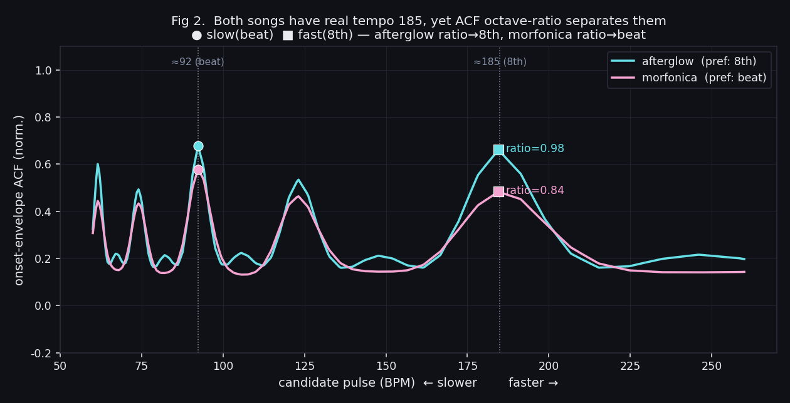
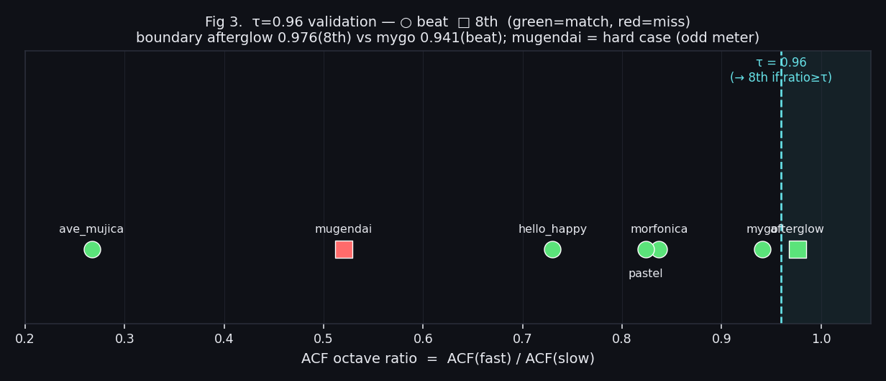

# 정확한 tempo가 아니라 "지각 pulse rate" — 재생 펄스 온셋 추출 여정

> **Perceptual Pulse-Rate Estimation for Playback Visualization: Why Correct Tempo Is the Wrong Target**
>
> 프로젝트: `bandori-song-sorter` · 브랜치 `feature/emoi-cluster-v3b`
> 기간: 2026-07-04 · 대상: 음원맵 재생 펄스(F2) · 파일럿 7밴드 대표곡 → 전곡 660
> 상세 원자료: [`emoi-cluster-pulse/README.md`](../working/report/emoi-cluster-pulse/README.md)

---

## 초록 (Abstract)

음원맵에서 재생 중인 곡의 위치에 **박자에 맞춰 펄스(물결)를 방출**하는 시각 연출을 구현하기 위해, 우리는 네 세대의 방법론을 거쳤다: **(1)** BPM 등간격 펄스, **(2)** 커스텀 zrender 펄스, **(3)** onset 검출(드럼 분리), **(4)** beat 그리드. 각 전환은 앞 방법의 구체적 실패에서 비롯됐다 — 위상 무시, 발생간격·전파속도 결합, onset envelope의 plateau 문제. 채택된 beat 그리드 방식조차 **subdivision(박/8분/16분) 선택**이라는 미해결 과제를 남겼는데, 그 근원을 파고들며 이 연구의 핵심 발견에 도달했다: **afterglow와 morfonica는 실제 tempo가 둘 다 185 BPM으로 동일한데도 어울리는 펄스가 각각 8분(185)과 박(92)으로 다르다.** 즉 맞춰야 할 대상은 "정확한 악보 tempo"가 아니라 **곡에 어울리는 지각적 pulse rate**이며, 정확 tempo로는 원리적으로 구분이 불가능하다. 해법은 **onset-envelope 자기상관(ACF)의 옥타브 비율 규칙**이다 — `ACF(fast) ≥ ACF(slow)·τ`이면 빠른 pulse를 채택하며, 이 **비율 자체가 "빠른 pulse가 얼마나 두드러지나"라는 지각 pulse 지표**가 된다. τ=0.96에서 파일럿 7곡 중 6곡이 사용자 선호와 일치했다. 그러나 방안 A는 여전히 "곡당 단일 pulse"였다. 전곡 660으로 확대하며 우리는 한 걸음 더 나아가, 곡 구조 판별 없이 **에너지(음량)로 subdivision을 동적 제어**하는 방식에 도달했다(조용=박·고조=8분). 결정적 교훈은 **정규화 방향**이다 — 밀도(subdivision)는 곡 간 비교가 필요해 **글로벌 절대음량**으로, 펄스 크기(볼륨 프리셋)는 곡 내 비교라 **곡별 상대값**으로, 서로 반대다.

---

## 1. 동기 (Motivation)

음원맵(F2)에서 곡을 재생하면, 그 곡의 좌표에서 **박자에 맞춰 물결이 퍼져 나가야** 한다. 실시간 오디오 분석(FFT)은 유튜브 iframe에서 불가능하므로, **캐시 음원을 사전 분석**해 이벤트 트랙을 만들고 재생 타임스탬프(`player.getCurrentTime()`)에 맞춰 프론트가 재생(playback)하는 **B안(lazy 사전계산)**을 택했다.

핵심 요구사항: 펄스는 (a) 실제 곡의 박에 위상이 맞고, (b) 강한 박은 크고 묵직하게, 약한 박은 작게 반응해야 한다.

---

## 2. 방법론 진화 (Method Evolution)

### 세대 1 — BPM 등간격 펄스 : ❌ 위상 무시

`rippleEffect.period = 60/bpm`. **위상(phase)을 무시**해 실제 비트와 어긋나고, 빠른 곡은 부산스러웠다. 계단식 박 묶음·전역 배율로 다듬었으나 근본 해결이 안 됐다.

### 세대 2 — 커스텀 zrender 펄스 : 간격·속도 분리

effectScatter의 연속 물결은 '발생 간격'과 '퍼지는 속도'가 `period` 하나로 묶여 분리 불가였다. → **박 타이밍마다 zrender 원을 직접 그려** 짧게 커지며 사라지게 했다. 간격과 속도를 분리해 박자감을 확보.

### 세대 3 — onset 검출(드럼 분리) : ❌ plateau 문제

"기타·보컬에 반응한다"는 문제로 **demucs로 드럼 스템을 분리**한 뒤 onset을 검출했다. 하이햇 연타 과다는 저역통과·임계로 눌렀으나, **치명적 한계**가 있었다: 연속 균일 타격 구간은 onset envelope가 **plateau**가 되어 상대 peak(delta)로 개별 히트를 못 잡는다 → 둔감하면 통째로 놓치고, 민감하면 다른 구간이 과다해진다. HOP 512→256(12ms)으로 시간해상도를 높여 상당히 개선됐지만(8초 인트로 필인 1개→6~10개), **"실제로 친 것"을 쫓는 접근 자체가 불안정**했다.

### 세대 4 — beat 그리드 : ✅ 채택

onset 검출을 버리고 **규칙적 박 그리드**로 전환했다.

- `librosa.beat.beat_track`은 등간격이 아니라 **실제 곡 pulse 위상에 정렬**(drift 없음).
- 조용/시끄러운 구간과 무관하게 **항상 박에 존재** → 놓침·과다가 없다.
- 세기는 **각 박의 드럼 볼륨(RMS)을 단계화**해 → 조용한 박은 작게, 강한 다운비트는 크게·묵직하게.
- subdivision(박/8분/16분) 레벨을 함께 산출해 곡에 맞는 밀도를 고를 수 있게 했다.

> **부수 발견 — demucs `torchcodec` 우회**: torchaudio 2.12의 `ta.load`가 `torchcodec`을 요구(미설치 시 실패)한다. **오디오를 librosa로 로드해 텐서로 직접 `apply_model`** 하면 우회된다(`separate_drums.py`, htdemucs CPU).

---

## 3. 핵심 문제 — subdivision 선호는 tempo로 풀 수 없다

beat 그리드는 잘 작동했지만, **어떤 subdivision을 기본으로 쓸지**가 남았다. 처음엔 "tempo로 자동 판정 불가"로 결론지었는데, 실제 BPM을 확인하자 진짜 원인이 드러났다:

| 곡 | `feature.tempo` | `beat_track` | 실제 BPM | 선호 pulse |
|----|----------------:|-------------:|---------:|-----------|
| **afterglow** (ON YOUR MARK) | 123 | 92.3 | **185** | **8분** (185) |
| **morfonica** (Daylight) | 123 | 92.3 | **185** | **박** (92) |
| mugendai (アイの夢限) | 117.5 | 120.2 | 135 | 8분 |

**핵심 반전**: afterglow와 morfonica는 **실제 tempo(185)·라이브러리 측정(92.3)·IOI(0.15s)가 전부 동일**한데 원하는 펄스가 다르다. afterglow는 드럼이 꽉 차 185 pulse가 두드러지고(8분), morfonica는 강세가 92.3 간격의 하프타임 느낌이다(박).

> **결론**: tempo로는 — 실제 tempo든 측정 tempo든 — 이 둘을 **원리적으로 구분할 수 없다.** 외부 BPM을 grid로 직접 쓰면 오히려 틀린다(morfonica를 185로 강제하면 박 선호와 어긋남). 맞춰야 할 것은 정확한 tempo가 아니라 **곡에 어울리는 지각적 pulse rate**다.

---

## 4. 목표 재정의와 방안 A — ACF 옥타브 비율

목표를 "정확 tempo 추정"에서 **"지각 pulse rate 추정"**으로 재정의했다. 방법은 onset-envelope **자기상관(ACF)의 옥타브 비율 규칙**이다.

- onset envelope의 ACF는 후보 pulse와 그 옥타브(×½·×1·×2)의 반복성을 측정한다.
- **관찰**: ACF 최고값은 **느린 옥타브로 편향**된다(자기상관 배음). 단독으로 쓰면 항상 절반 tempo를 고른다.
- **옥타브 쌍 비율 규칙**: base(beat_track)와 그 ×2의 ACF를 비교해, `ratio = ACF(fast)/ACF(slow) ≥ τ`이면 빠른 pulse를 채택한다. 이 **비율 자체가 "빠른 pulse가 얼마나 두드러지나" = 지각 pulse 지표**다.



> **Fig 2.** 실제 드럼 스템에서 계산한 onset-envelope ACF(BPM축). 두 곡 모두 ≈92(박)에서 비슷한 봉우리를 갖지만, **≈185(8분)에서 afterglow의 ACF(0.66)는 morfonica(0.48)보다 훨씬 높다**. 그 결과 ratio가 afterglow 0.98 vs morfonica 0.84로 갈려, **실제 tempo가 둘 다 185로 동일함에도** 8분/박을 정확히 구분한다. 이 방법은 "tempo 추정기"가 아니라 **지각 pulse 추정기**라서 목표에 정확히 부합한다.

이 접근은 **정확 tempo로는 불가능했던 구분**을 해낸다 — 그것이 방안 A가 옳은 이유다.

---

## 5. 검증 — τ 튜닝과 파일럿 (Validation)

`build_beat_track.py`의 `perceptual_pulse()`가 base와 ×2의 ACF를 비교해 `ratio ≥ τ`이면 8분(div 2)을 채택하고, onsets json에 `pulse:{pulse_bpm, pulse_div, slow, fast, acf_slow, acf_fast, ratio, tau}`를 저장한다.



> **Fig 3.** 파일럿 7곡을 ratio 축에 배치(○=박 선호, □=8분 선호). τ=0.96을 경계로 오른쪽이 8분 채택. 경계는 afterglow 0.976(8분)과 mygo 0.941(박) 사이로 좁다.

| 곡 | ratio | 판정 pulse | 선호 | 일치 |
|----|------:|-----------|------|:----:|
| afterglow | 0.976 | 185 (8분) | 8분 | ✅ |
| mygo | 0.941 | 95.7 (박) | 박 | ✅ |
| morfonica | 0.837 | 92.3 (박) | 박 | ✅ |
| pastel | 0.824 | 143.6 (박) | 박 | ✅ |
| hello_happy | 0.73 | 123 (박) | 박 | ✅ |
| ave_mujica | 0.267 | 132.5 (박) | 박 | ✅ |
| **mugendai** | 0.52 | 120.2 (박) | 8분 | ❌ 난곡 |

- **τ 재튜닝 0.9→0.96**: 초안 τ≈0.9는 afterglow/morfonica 2곡만 본 값이었다. **mygo(ratio 0.941, 선호 박)**가 τ=0.9에서 8분으로 오검출 → 정답 경계 afterglow 0.976 vs mygo 0.941 사이인 **0.96**으로 상향해 정정(6/7).
- ⚠️ **마진이 좁다(0.941~0.976)** → 전곡 660 확대 시 오버피팅 재검증 필요.
- **mugendai만 실패**: 빠른 pulse가 ACF로 안 두드러지는데 8분 선호(변박·약한 다운비트) — τ로 불가능한 난곡. 수동 큐레이션(`CL_ONSET_DEFDIV`)으로 예외 처리.

---

## 6. 파이프라인과 구현 (Pipeline)

| 파일 | 역할 |
|------|------|
| `separate_drums.py` | demucs htdemucs로 드럼 스템 분리 → `audio_drums/<band>__<idx>.wav` (원본 미수정, librosa 읽기전용) |
| `build_beat_track.py` | 드럼 스템 → beat 그리드 + `perceptual_pulse()` → `onsets/<band>__<idx>.json` |
| `build_pulse_all.py` | 매니페스트 전곡 순회(멱등 배치). demucs가 CPU 곡당 ~45–150s → 전곡은 수 시간(무인 배치) |
| `16-audiomap.js` | 재생 타임스탬프 폴링 → 펄스 방출(`_clOnsetTick`), 볼륨 단계별 크기·전파속도 |

트랙 스키마: `{sr, dur, tempo, pulse:{…}, levels:[{name, div, n, events:[{t, v}]}]}` (`t`=시각초, `v`=드럼 RMS 0~1 정규화).

**프론트 기본 subdivision**: 사용자 지정으로 **8분 고정**(`_clSensIdx = CL_ONSET_DEFDIV[key] ?? 1`). 추출은 박/8분/16분 3레벨을 모두 산출하므로, 향후 '설정' 패널이나 곡별 예외(`pulse.pulse_div` 소비) 확장 여지가 열려 있다.

---

## 7. 전곡 확대와 동적 subdivision (실제 귀결)

방안 A로 파일럿을 검증한 뒤 전곡 660으로 확대하며, "곡당 단일 pulse"라는 전제 자체를 넘어섰다.

### 7.1 방안 A의 한계
- **좁은 τ 마진**: 파일럿 7곡 기반 → 전곡 재검증 필요(오버피팅 주의).
- **난곡**: 변박·약한 다운비트(mugendai)는 ACF로 지각 pulse를 못 잡아 수동 큐레이션 의존.
- **곡 내 변화 무시**: pulse는 곡 안에서도 변한다 — verse는 차분(박), chorus는 꽉 참(8분). 곡당 하나로는 못 담는다.

### 7.2 렌더 스케일 → lazy-fetch (해결)
onsets 660곡 ≈42MB → index.html 인라인 불가. `build.py`가 경량 매니페스트(`load_onset_list`)만 주입하고 데이터는 **런타임 곡별 fetch**(`_clFetchOnset`, 캐시·`file://`→BPM 폴백). index.html **0.30MB**, `.nojekyll`로 Pages가 `src/` 서빙. (드럼 스템 캐시 `audio_drums/`는 대용량 gitignore — 다른 장치에선 재분리 필요.)

### 7.3 곡 구조(section) 기반 — 탐색 후 보류
"section별로 pulse가 다르다"는 착상으로 `librosa.segment`(tempogram) 국소 분할 + 구간별 국소 ACF를 프로토타입했다(`section_pulse_proto.py`). **millsage에서 172↔112 두 pulse의 구간 전환을 실제로 검출**했다. 그러나 구조 분할은 비싸고 취약(특히 반복 적은 매스락), 의미 라벨(intro/verse) 추정은 오디오만으로 불안정 — 실사용엔 과했다.

### 7.4 에너지 기반 동적 subdivision (채택)
곡 구조를 **판별하지 않고** 에너지(음량)로 subdivision을 직접 제어한다: 조용(intro/outro/브레이크다운/잔잔한 1절)=박, 고조=8분.
- **진단 게이트**(`diagnose_pulse_variability.py`): full-mix tempogram → **옥타브 원(circular) spread**로 곡 내 pulse 변동 측정(선형 std는 90 BPM fold 경계에서 89↔92를 92↔178로 쪼개는 위양성 → circular로 해결). 전곡 ~70% 안정, ~22%만 강한 변동.
- **정규화의 핵심 = 글로벌 절대음량**: 곡별(per-song) 정규화는 곡 간 절대 energy 차이를 뭉갠다(Symbol I처럼 시종 시끄러운 곡에 박 오지정). `build_dynamics.py`가 RMS dB를 **글로벌 앵커(−22~−7dB)**로 정규화 → `dyn` 곡선(2Hz). 검증: ave_mujica `Symbol I`(절대 −8dB 평탄)=시종 dense, roselia `軌跡`(1절 −20dB)=박.
- **렌더**: `_clDynLevel`이 매 프레임 `dyn` 임계로 박/8분 선택(레벨 변화 시 재-bisect, 히스테리시스). §6의 "8분 고정" 기본은 이 동적 방식으로 대체됐다.

### 7.5 두 축의 정규화 방향 (핵심 통찰)
- **밀도**(얼마나 자주 = subdivision) ← **글로벌 절대** energy(음량). 곡 간 비교가 필요.
- **크기·두께**(얼마나 세게 = 볼륨 프리셋 4단계) ← **곡 내 상대** volume(`_clOnsetVmax` 상대화). 곡 내 punch 비교.

정규화 방향이 반대인 게 의도적이다 — 한 곡이 절대적으로 조용하면 성기게 뛰되(글로벌), 그 안에서 가장 센 히트는 큰 펄스가 된다(상대).

---

## 8. 재현 (Reproduction)

```bash
# 전곡 펄스 배치(멱등). 원본 audio_full 미수정.
python src/tools/cluster/build_pulse_all.py --manifest src/content/cluster/songs_full.csv

# 단일 곡
python src/tools/cluster/separate_drums.py afterglow 0          # → audio_drums/afterglow__000.wav
python src/tools/cluster/build_beat_track.py afterglow 0        # → onsets/afterglow__000.json
```

`perceptual_pulse()` 핵심(요약):
```python
acf = librosa.autocorrelate(onset_env); acf /= acf[0]
a_slow = acf[lag(base_tempo)];  a_fast = acf[lag(base_tempo*2)]
ratio = a_fast / a_slow
take_fast = ratio >= 0.96 and 90 <= base_tempo*2 <= 200   # → div 2 (8분)
```

---

*작성 2026-07-04 · 자매 논문 [cluster-map-extraction.md](cluster-map-extraction.md)(음원맵 좌표 추출 여정).*
