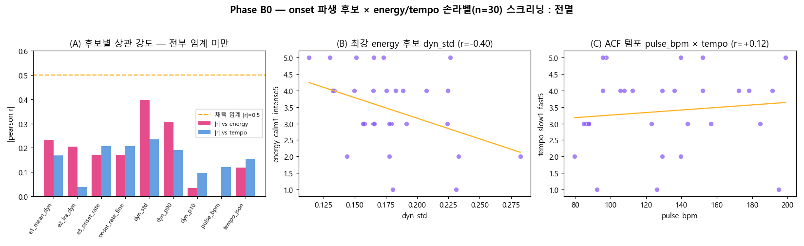

# EMOI-MAP energy/tempo 축 — Phase B0 스크리닝 검정

> 작업 5(EMOI-MAP 좌표계 고찰) · 브랜치 `feature/emoi-cluster-energy-tempo`
> 상위 문서: [../../../idea/260708-final_comment.md](../../../idea/260708-final_comment.md) §2·§3 Phase B0
> 실행일: 2026-07-07

## 목적
현행 EMOI-MAP 두 축(x=contrast 거칢, y=mode 밝음)은 **경쾌함/에너지(지각축②, 라벨 간 r=0.81)** 를
못 잡는다(Millsage·Ikka 오독의 근본). Phase B0는 **오디오 재추출 없이(base env)** onset JSON에서
파생 가능한 후보 feature가 이 빈 축을 채울 수 있는지 **저비용 스크리닝**한다. 통과하면 Phase C에서
라벨 확대 확정검정, **전멸이면 Phase C(정식 LRA·tempogram, 오디오 필요)로 직행**.

## 방법
- **후보**(660곡 onset JSON `dyn.v`·`levels`·`pulse`에서 산출, `b0_onset_features.py`):
  - `e1_mean_dyn` = mean(dyn.v) — 전체 강도(현 energy 원천)
  - `e2_lra_dyn` = p90−p10(dyn.v) — 다이내믹 레인지(LRA 근사)
  - `e3_onset_rate` = 박레벨 온셋/s · `onset_rate_fine` = 최密 온셋/s
  - `dyn_std`·`dyn_p90`·`dyn_p10` — 강도 분포
  - `pulse_bpm` = ACF 기반 템포(librosa tempo와 별개) · `tempo_json` = librosa 템포(참고)
- **라벨**: `axis_labels_worksheet.csv`의 `energy_calm1_intense5`·`tempo_slow1_fast5`(손 라벨, n=30).
  조인 = youtube id(url→vid)로 worksheet↔songs_full↔onset_features 묶음(30/30 매칭).
- **상관**: Pearson r·Spearman ρ (`b0_correlate.py`, axis_correlation.py 방법론 재사용).
- **판정**: |r| ≥ 0.5 (p<0.05) with energy 또는 tempo **AND** 기존 축과 독립(|r| ≲ 0.4 with x·y).

## 결과 — ✗ 전멸 (PASS 0/9)



**energy 라벨(n=30)** 상위 — 전부 임계 미만:

| 후보 | pearson r | p | 비고 |
|------|----------:|---:|------|
| `dyn_std` | **−0.397** | 0.030 | 최강이나 <0.5 · **부호 반대**(강할수록 '잔잔'?) |
| `dyn_p90` | −0.305 | 0.101 | 유의성 없음 |
| `e1_mean_dyn` (E1) | −0.233 | 0.215 | |
| `e2_lra_dyn` (E2) | −0.204 | 0.280 | |
| `e3_onset_rate` (E3) | +0.171 | 0.365 | |

**tempo 라벨(n=30)** 상위 — 전부 무의미:

| 후보 | pearson r | p | 비고 |
|------|----------:|---:|------|
| `e3_onset_rate` | +0.207 | 0.272 | |
| `tempo_json` | +0.155 | 0.412 | librosa 템포(옥타브오류 기지) |
| `pulse_bpm` | +0.121 | 0.525 | **ACF 템포마저 무관** |

**독립성(전곡 660, 후보↔기존 축)**: 모든 후보 |r| ≤ 0.40 (최대 `e1_mean_dyn` r_x=+0.40, `dyn_p10` r_x=+0.38).
→ 축 공간은 독립이나(빈 축을 채울 자리는 있으나) **후보가 라벨을 못 맞혀 무의미**.

## 해석 (왜 전멸인가)
1. **`dyn.v`는 곡별 정규화값** — 재생 펄스 연출용으로 곡마다 자기 최대에 상대화됐다(음원맵 세션24~25).
   그래서 **곡 간 절대 에너지 차이가 씻김** → energy 라벨과 상관이 약하고 심지어 부호가 뒤집힌다
   (강도 편차 큰 곡이 오히려 '잔잔'으로 라벨되는 착시). doc §2가 예측한 "라우드니스 평준화로 E1이
   뭉치는지 여기서 판명" = **뭉침 확인**. → energy 축엔 **절대 라우드니스(LUFS)** 가 필요.
2. **온셋 밀도·ACF 템포도 tempo 라벨과 무관**(r≤0.21). 온셋 카운트는 편곡 밀도이지 지각 템포가 아니고,
   ACF `pulse_bpm`도 옥타브·박/분박 혼동을 못 넘는다. → tempo 축엔 **정식 tempogram**(자기상관 피크,
   옥타브오류 완화)이 필요.

## 결론 · 다음
- **onset 파생만으로 energy/tempo 축 성립 불가 → Phase C 직행**(doc §3 Phase C, §6 순서와 일치).
- **Phase C**(완비 로컬·hummingbird env): `perceptual_features.py` 확장 —
  ① 정식 **loudness range**(pyloudnorm 단기 LUFS 스프레드, `dyn.v` 정규화값이 아닌 원본 오디오)
  ② **tempogram** 지각 템포 → `axis_correlation.py` 확정검정.
- ⚠️ **오디오 캐시(`audio_full`) 폐기 금지** — Phase C가 원본 오디오를 다시 필요로 한다(전멸이라 더 확실).
- 라벨 n=30은 작지만, **신호 부재는 표본 문제가 아니라 feature 문제**(부호까지 반대) → Phase C는
  feature 교체가 먼저, 라벨 확대는 그다음.

## 산출물 · 재현
```
python src/tools/cluster/b0_onset_features.py   # onset_features.csv (660, 진행률 b0_progress.json)
python src/tools/cluster/b0_correlate.py        # b0_correlation.{txt,json}
python src/tools/cluster/b0_plot.py             # b0_screening.png
```
- `onset_features.csv` — 후보 feature 660곡(재실행 시 체크포인트 skip·재개).
- `b0_correlation.txt`/`.json` — 상관표·판정(기계판).
- `b0_screening.png` — 요약 그림.
- `b0_progress.json` — 진행률·ETA·마지막 곡·상태(running/paused/done). `b0_control.json`{command:pause} 로 협조적 중단.
