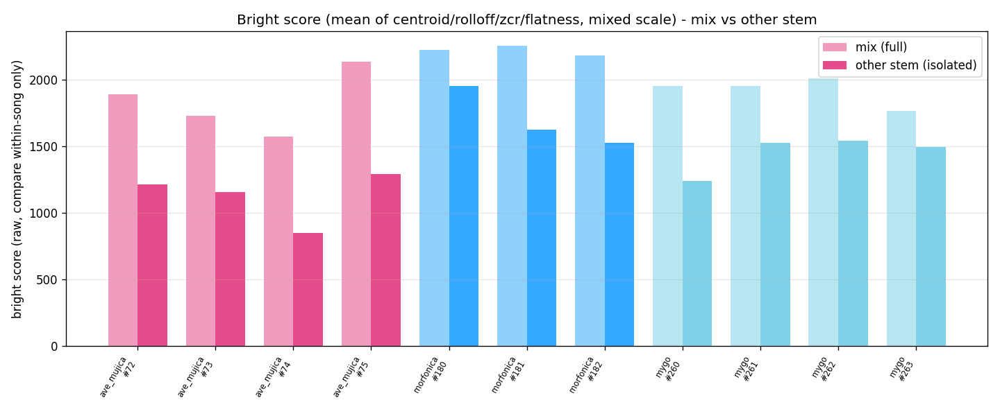
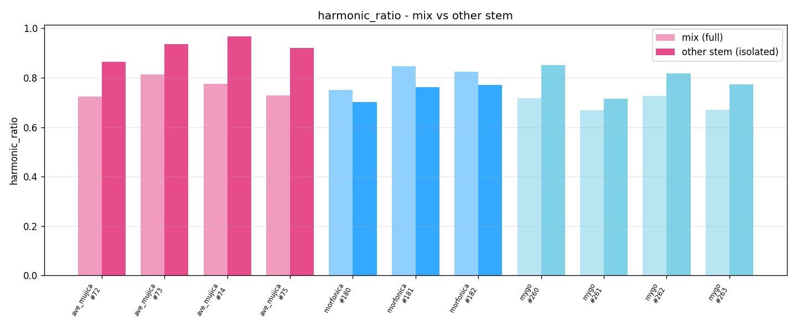
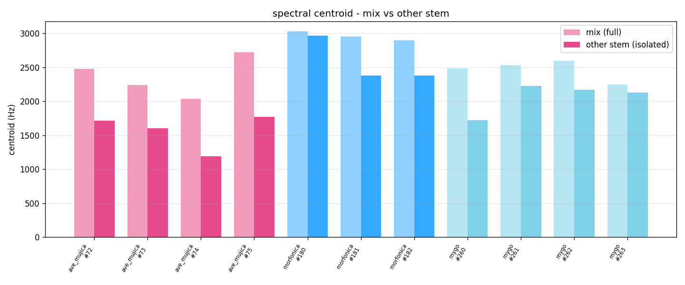

# 실험: Demucs "other" 스템 재측정 — 가설 기각

`README.md`(세션 37, 7항목 밴드별 분포 분석)가 세운 가설 — "밝기군(centroid/rolloff/zcr/flatness)이
낮은 건 어두운 믹스(베이스·드럼 등)가 화성악기 음색을 가려서다, other 스템(보컬·드럼·베이스 제외)만
남기면 밝기가 올라가 acoustic 과다분류가 완화될 것" — 을 실제로 측정해 검증했다. **결과: 가설 기각.**
방향이 정반대로 나왔다.

## 방법
- **표본**: mygo 4곡(#260~263) · ave_mujica 4곡(#72~75, 과다분류 발견 밴드) · morfonica 3곡(#180~182,
  양성 대조군 — acoustic 채널이 장르와 이미 일치하는 밴드에서도 other 스템이 망가뜨리지 않는지 확인).
  총 11곡. 이 로컬에 오디오가 있는 밴드 중 선택(raise_a_suilen 등 다른 밴드는 로컬에 오디오 없음).
- **분리**: `htdemucs`(Demucs 4.0.1, hummingbird env) 4-스템(drums/bass/other/vocals) 중 `other`만
  사용. CPU 추론, 곡당 ~3.5분(11곡 총 ~43분). 분리 WAV는 저장하지 않고 피처만 추출 후 폐기(용량).
- **피처 재측정**: `genre_features_extract.py`의 `compute()`(중앙 45초 excerpt, HPSS harmonic_ratio·
  librosa timbre 피처)를 other 스템에 그대로 재사용 — mix 기반 측정(`song_features_with_proxies.csv`)과
  **동일 함수·동일 파라미터**라 직접 비교 가능.
- 스크립트: `extract_other_stem_features.py`(추출) → `compare_stem_vs_mix.py`(병합·델타) →
  `plot_stem_comparison.py`(시각화).

## 결과

**밝기군 평균 델타(other − mix), 11곡 전부 음수 — 예외 없음:**

| band | bright(mix) | bright(other) | Δ |
|---|---:|---:|---:|
| ave_mujica | 1833.9 | 1130.4 | **−703.6** |
| morfonica(대조군) | 2221.6 | 1702.8 | **−518.8** |
| mygo | 1921.7 | 1452.5 | **−469.2** |

**harmonic_ratio 델타 — 밴드별로 방향이 갈림:**

| band | harmonic_ratio(mix) | harmonic_ratio(other) | Δ |
|---|---:|---:|---:|
| ave_mujica | 0.760 | 0.922 | **+0.162** (더 상승) |
| mygo | 0.695 | 0.789 | **+0.094** (더 상승) |
| morfonica(대조군) | 0.807 | 0.745 | **−0.063** (하락) |

## 해석 — 가설이 예측한 것과 정반대

1. **밝기군이 other 스템에서 오히려 전부 떨어졌다**(대조군 morfonica 포함, 11곡 전원 예외 없음).
   당초 가설은 "베이스·드럼의 저음이 밝기 지표를 끌어내린다"였는데, 실제로는 **드럼(특히 심벌·하이햇의
   광대역 고주파)과 보컬(치찰음)이 믹스의 고주파 에너지를 상당 부분 차지**하고 있었던 것으로 보인다.
   이걸 제거하면 그 고주파가 같이 빠지면서 centroid·rolloff가 낮아진다 — 방향이 완전히 반대.
2. **ave_mujica·mygo는 harmonic_ratio까지 더 올라가서, other 스템으로 바꾸면 acoustic 과다분류가
   완화가 아니라 악화**된다(밝기는 더 떨어지고 harmonic_ratio는 더 오르니 두 방향 다 acoustic 쪽으로
   더 쏠림). 대조군 morfonica는 harmonic_ratio가 오히려 소폭 하락 — 밴드 간 반응이 일관되지 않아
   "간단한 보정 계수"로 처리하기도 어려워 보인다.
3. 표본이 작아(밴드당 3~4곡) 통계적 유의성은 없지만, **방향성이 11곡·3밴드 전부 동일**(밝기 하락)해서
   우연으로 보긴 어렵다.

## 검증의 유효성(사용자 질문 — 표본 일부만으로 판단해도 되는가)

**표본 부분성**:
- 전곡 660 중 11곡(1.7%), 13밴드 중 3밴드만 — **일반화에는 명백히 부족**.
- raise_a_suilen 같은 "bright 채널이 이미 장르와 일치하는" 밴드가 로컬에 없어 **bright 방향
  대조군이 빠져있음**(morfonica는 acoustic 방향 대조군만 커버).
- 곡당 45초 center excerpt(기존 파이프라인과 동일 규약)만 봤다 — 곡 전체를 다 본 게 아님.

**그럼에도 이 결론(가설 기각)은 신뢰할 만한 이유**:
- 검증하려던 건 "정밀한 수치"가 아니라 **방향(밝기가 오르는가 내리는가)**이고, 그 방향이
  **11곡 전부, 대조군 포함 예외 없이 하나로 일치**했다 — 표본이 작아도 부호가 뒤집힐 여지가
  거의 없는 강한 신호. 만약 진짜 효과가 없거나 반대라면 3~4곡씩이라도 최소 1~2곡은 반대 방향이
  나왔을 확률이 높다(순수 잡음이면 이항분포로 11/11 동일방향 확률은 극히 낮음, 1/2^11 ≈ 0.05%).
- **물리적으로도 설명 가능한 메커니즘**(드럼 심벌·보컬 치찰음이 고주파 에너지원)이라 우연한 패턴이
  아니라 구조적 원인일 가능성이 크다.
- **표본 확대가 필요한 건 "효과 크기"나 "밴드별 예외 패턴"이지, "이 방법을 도입해도 되는가"라는
  당장의 의사결정에는 불필요** — 이미 방향이 반대로 나왔으므로, 이 접근(other 스템 밝기 재측정)은
  **표본을 늘려도 결론이 뒤집힐 가능성이 낮다**(뒤집히려면 마이너스가 절반 이상 플러스로 바뀌어야
  하는데 지금 신호가 그럴 여지를 안 남김).

**결론: 표본은 작지만 이 실험의 목적("other 스템이 문제를 완화하는가")에 답하기엔 충분하다 —
답은 "아니오, 오히려 악화시킨다"이고, 이건 표본을 늘린다고 바뀔 성질의 결과가 아니다.**

## 다음 결정
- **other 스템 단독 재측정 접근은 폐기**. 세션 37이 제시한 다른 대안(bright 그룹 코퍼스 전체
  재정규화, neutral 임계값 조정)으로 방향 전환 필요.
- 대안: drums+vocals를 뺀 게 아니라 **vocals만 뺀 스템**(drums+bass+other 합성, "instrumental mix")을
  시도하면 심벌 고주파는 유지하면서 보컬 치찰음만 제거 — 밝기 하락 폭이 줄어들 수 있음(미검증,
  후속 실험 후보).

## 파일
- `extract_other_stem_features.py` — Demucs other 스템 분리 + 피처 추출(hummingbird env).
- `compare_stem_vs_mix.py` — mix/other 병합·델타 계산(base env).
- `plot_stem_comparison.py` — 시각화.
- `other_stem_features.csv` — other 스템 원시 피처(11곡).
- `stem_vs_mix_comparison.csv` — mix/other 병합·델타.
- `fig/{bright,harmonic_ratio,centroid}_mix_vs_other.png`.
